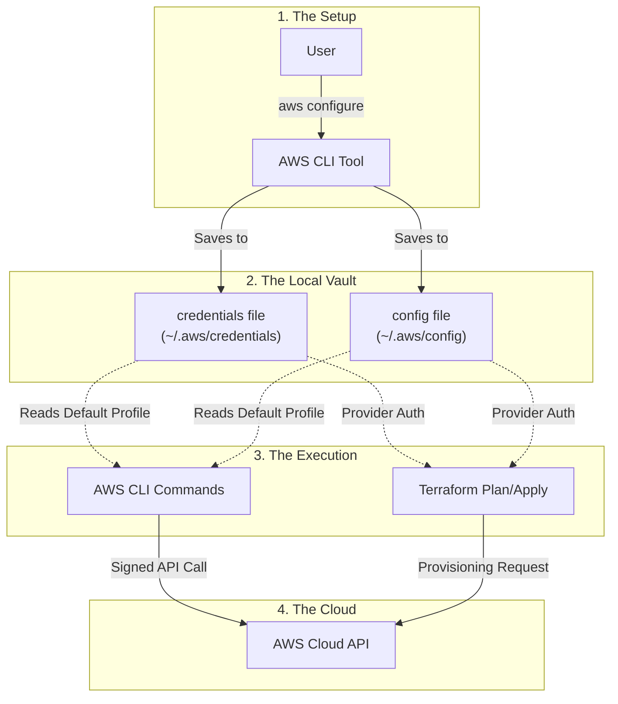

## 1. Prerequisites

You need:

* IAM user created
* Access key ID
* Secret access key
* Terraform installed (`terraform version`)
* AWS account ID (optional but useful)

---

## 2. Recommended & Secure Way

**Best practice**: Configure credentials once, Terraform auto-picks them up.

### Step 2.1 – Configure AWS CLI

Run on your machine:

```bash
aws configure
```

Enter:

```
AWS Access Key ID     = AKIA...
AWS Secret Access Key = ********
Default region name   = us-east-1
Default output format = json
```

This creates:

```
~/.aws/credentials
~/.aws/config
```
> Understand the below flow of how terraform will authenticate with AWS via API calls.



## `~/.aws/credentials`

**WHAT it is**

* Stores **AWS login secrets**
* Used by AWS CLI, Terraform, SDKs

**WHAT it contains**

* Access Key
* Secret Key
* (Optionally) Session token

Example:

```
[default]
aws_access_key_id=AKIA...
aws_secret_access_key=****
```
> ⚠️ **Never commit this to Git**
---

## `~/.aws/config`

**WHAT it is**

* Stores **non-secret settings**
* Region, output format, assume-role info

**WHAT it contains**

```
[default]
region=us-east-1
output=json
```

With role:

```
[profile dev]
role_arn=arn:aws:iam::123456789012:role/TerraformRole
source_profile=default
region=us-east-1
```

## How they work together

```
credentials → WHO you are
config      → HOW and WHERE you work
```
AWS tools read **both automatically**.


---

## 3. Terraform AWS Provider (minimum required)

Create `provider.tf`:

```hcl
terraform {
  required_providers {
    aws = {
      source  = "hashicorp/aws"
      version = "~> 5.0"
    }
  }
}

provider "aws" {
  region = "us-east-1"
}
```

 No credentials needed here (they come from AWS CLI).

---

## 4. Test connectivity (important)

Create `main.tf`:

```hcl
data "aws_caller_identity" "current" {}
```

Run:

```bash
terraform init
terraform plan
```

If this works, Terraform is **successfully communicating with AWS**

---

## 5. Alternative : Environment variables

Only use this for quick tests or CI pipelines. But its absolutely NOT recommended for prod, Since the credentilas are open to the team.

```bash
export AWS_ACCESS_KEY_ID=AKIA...
export AWS_SECRET_ACCESS_KEY=...
export AWS_DEFAULT_REGION=us-east-1
```

Terraform will pick these up automatically.

> ⚠️ Do **not** commit these to Git.

---

## 6. Best Practice for Teams

### Why?

* No long-lived credentials
* Better security
* Required in enterprise setups

### Step 6.1 – IAM User policy 

```json
{
  "Version": "2012-10-17",
  "Statement": [
    {
      "Effect": "Allow",
      "Action": "sts:AssumeRole",
      "Resource": "arn:aws:iam::ACCOUNT_ID:role/TerraformRole"
    }
  ]
}
```

---

### Step 6.2 – Role trust policy

```json
{
  "Version": "2012-10-17",
  "Statement": [
    {
      "Effect": "Allow",
      "Principal": {
        "AWS": "arn:aws:iam::ACCOUNT_ID:user/IAMUserName"
      },
      "Action": "sts:AssumeRole"
    }
  ]
}
```

---

### Step 6.3 – Terraform provider with assume role

```hcl
provider "aws" {
  region = "us-east-1"

  assume_role {
    role_arn = "arn:aws:iam::ACCOUNT_ID:role/TerraformRole"
    session_name = "terraform-session"
  }
}
```

This is how **real DevOps teams** do it.

---

## 7. IAM permissions

Attach to the **role**, not user:

```json
{
  "Version": "2012-10-17",
  "Statement": [
    {
      "Effect": "Allow",
      "Action": [
        "ec2:*",
        "s3:*",
        "iam:PassRole"
      ],
      "Resource": "*"
    }
  ]
}
```

(Restrict later — start broad, then lock down.)

---

## 8. Common mistakes

* Putting access keys inside `.tf` files
* Committing `.aws/credentials` to Git
* Giving `AdministratorAccess` forever
* Not using AssumeRole in teams

