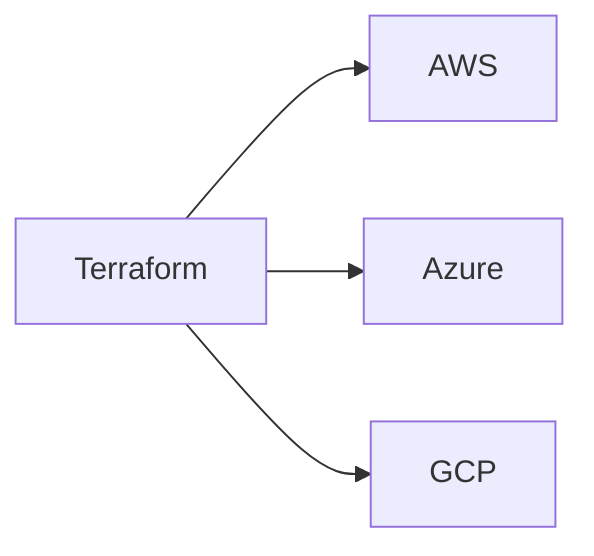
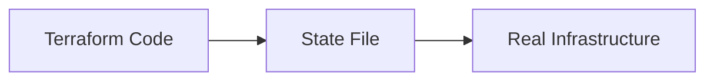
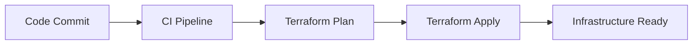

# 01.01 Infrastructure & IaC Fundamentals

## 1. What is Infrastructure?

Infrastructure is everything required to **run an application**.

It includes:

* Servers (physical or virtual)
* Networking (IP, DNS, Load Balancers)
* Storage (disks, object storage)
* Security (firewalls, IAM, certificates)
* Operating systems and runtime dependencies

### Simple analogy

* Application → House
* Infrastructure → Land, electricity, water, roads

Without infrastructure, applications cannot run.

---

## 2. Traditional Infrastructure vs Cloud Infrastructure

### Traditional Infrastructure (On‑Premise)

Characteristics:

* Physical servers in a data center
* Hardware procurement takes weeks/months
* Manual installation and configuration
* Scaling requires buying new hardware

Problems:

* Slow provisioning
* High upfront cost
* Difficult to scale
* Manual errors

### Cloud Infrastructure

Characteristics:

* Virtual resources
* Provisioned via APIs
* Pay‑as‑you‑use
* Elastic scaling

Benefits:

* Fast provisioning (minutes)
* No hardware management
* Easy scaling
* Automation friendly

### Comparison Table

| Aspect       | Traditional     | Cloud               |
| ------------ | --------------- | ------------------- |
| Provisioning | Manual          | API based           |
| Speed        | Slow            | Fast                |
| Scaling      | Hard            | Easy                |
| Cost model   | Capital expense | Operational expense |

---

## 3. Manual Provisioning Problems

Manual provisioning means:

* Clicking in cloud consoles
* Running commands manually
* Remembering steps

### Problems with Manual Provisioning

1. **Not Repeatable**

   * Same setup cannot be recreated exactly

2. **Error Prone**

   * Human mistakes

3. **No Version Control**

   * No history of changes

4. **Difficult Rollback**

   * Hard to undo mistakes

5. **Not Scalable**

   * Works for 1 server, fails at 100

---

## 4. What is Infrastructure as Code (IaC)?

Infrastructure as Code means:

> Managing infrastructure using **code** instead of manual steps

### Key Idea

* Infrastructure is written as files
* Files are stored in Git
* Changes are reviewed like application code

### Benefits of IaC

* Repeatable
* Version controlled
* Automated
* Auditable
* Consistent across environments

### IaC Concept Flow

---

## 5. IaC Tools Overview

### 5.1 Terraform

* Created by HashiCorp
* Cloud‑agnostic
* Declarative
* Uses state file

Used for:

* Multi‑cloud
* Infrastructure provisioning
* Standardized automation

---

### 5.2 CloudFormation (AWS)

* AWS native IaC tool
* Works only with AWS
* Tight AWS integration

Limitations:

* AWS only
* Complex templates

---

### 5.3 ARM / Bicep (Azure)

* Azure native IaC tools
* ARM is JSON based
* Bicep is simplified syntax

Limitations:

* Azure only

---

### 5.4 Pulumi

* Uses programming languages
* Developers friendly

Limitations:

* Less standardization
* Language complexity

---

### IaC Tool Comparison

| Tool           | Cloud Support | Language              |
| -------------- | ------------- | --------------------- |
| Terraform      | Multi‑cloud   | HCL                   |
| CloudFormation | AWS only      | YAML/JSON             |
| ARM/Bicep      | Azure only    | JSON/Bicep            |
| Pulumi         | Multi‑cloud   | Programming languages |

---

## 6. Why Terraform?

Terraform is chosen because of three core strengths.

---

### 6.1 Cloud‑Agnostic

* Same tool for AWS, Azure, GCP
* Avoids vendor lock‑in

---

### 6.2 Declarative Approach

You describe **what you want**, not **how to do it**.

Example idea:

* Desired state: "One virtual machine"
* Terraform figures out steps

Benefits:

* Simple
* Predictable
* Less procedural logic

---

### 6.3 State‑Driven

Terraform maintains a **state file**.

State file:

* Knows what exists
* Knows what changed
* Knows what to create or destroy

This is the most important concept in Terraform.

---

## 7. Where Terraform Fits in DevOps & CI/CD

Terraform is part of **infrastructure automation**.

### DevOps Pipeline View

Terraform:

* Runs before application deployment
* Prepares infrastructure
* Ensures consistency

---
