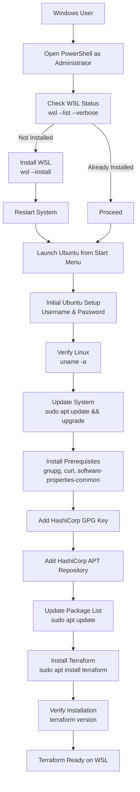

## 1. Installing Terraform

Terraform installation involves downloading the CLI binary.

Supported platforms:

* Linux
* Windows
* macOS

General installation steps:

1. Download Terraform binary
2. Place it in system PATH
3. Verify installation

Terraform does not require:

* Databases
* Agents
* Daemons

---

## 2. Setting Up Linux Using WSL (Windows Users)




Terraform is best learned on Linux.

### Step 1: Enable WSL

Open **PowerShell as Administrator** and run:

```powershell
wsl --list --verbose  # Check the wsl installed
wsl --install # Skip this if installed
```

This will:

* Enable WSL
* Install Ubuntu by default
* Enable required Windows features

Restart your system when prompted.

---

### Step 2: Launch Ubuntu

After reboot:

* Open **Start Menu**
* Search for **Ubuntu**
* Launch it

First-time setup:

* Set a **Linux username**
* Set a **password**

Now you are inside a **Linux terminal**.

Verify:

```bash
uname -a
```

If you see Linux output, WSL is working.

---

### Step 3: Update Linux System

Always update before installing tools:

```yaml
sudo apt update && sudo apt upgrade -y
```

---

## 3. Installing Terraform on Linux (WSL Ubuntu)

We’ll use the **official HashiCorp repository** (recommended way).

### Step 1: Install required packages

```yaml
sudo apt install -y gnupg software-properties-common curl
```
**What the command does**

Installs **gnupg** (verify software authenticity), **software-properties-common** (manage apt repositories), and **curl** (download files).

The `-y` flag auto-confirms the install so it runs without prompts.

**Is it safe?**

Yes—these are official Ubuntu packages and standard tools used by DevOps software.

They actually *increase* security by enabling signature verification and safe downloads.

---

### Step 2: Add HashiCorp GPG key

```bash
curl -fsSL https://apt.releases.hashicorp.com/gpg | sudo gpg --dearmor -o /usr/share/keyrings/hashicorp-archive-keyring.gpg
```

**What this command does**

It downloads HashiCorp’s official GPG signing key using `curl` and converts it into a format (`.gpg`) that APT can use to verify packages.

**Why it matters**
This ensures any HashiCorp software you install (like Terraform) is authentic and hasn’t been tampered with, protecting you from malicious or fake packages.

---

### Step 3: Add HashiCorp repository

```bash
echo "deb [signed-by=/usr/share/keyrings/hashicorp-archive-keyring.gpg] https://apt.releases.hashicorp.com $(lsb_release -cs) main" | sudo tee /etc/apt/sources.list.d/hashicorp.list
```

**What this command does**

It adds HashiCorp’s official APT repository to your system and links it to the trusted GPG key, using your Ubuntu version automatically.

**Why it matters**

This lets you install and update HashiCorp tools securely through `apt`, just like any other official system package.


---

### Step 4: Install Terraform

```bash
sudo apt update && sudo apt install terraform -y
```

---

### Step 5: Verify Installation

```bash
terraform version
```

Expected output (example):

```text
Terraform v1.x.x
```

If you see the version → Terraform is installed correctly

---
