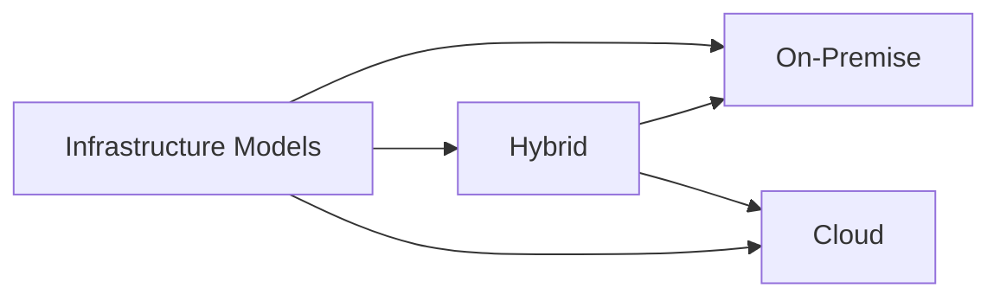
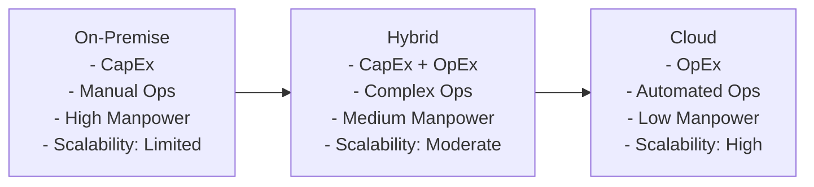
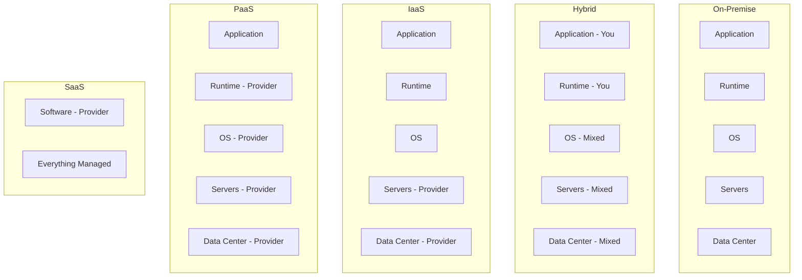
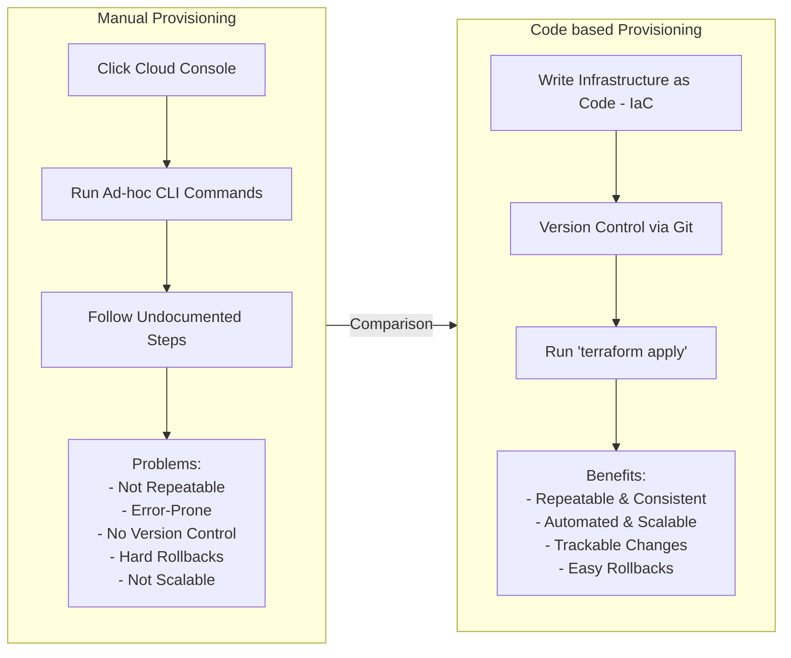
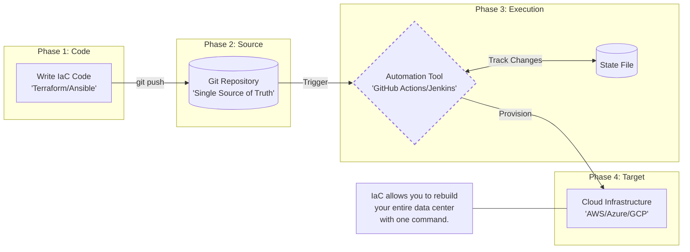
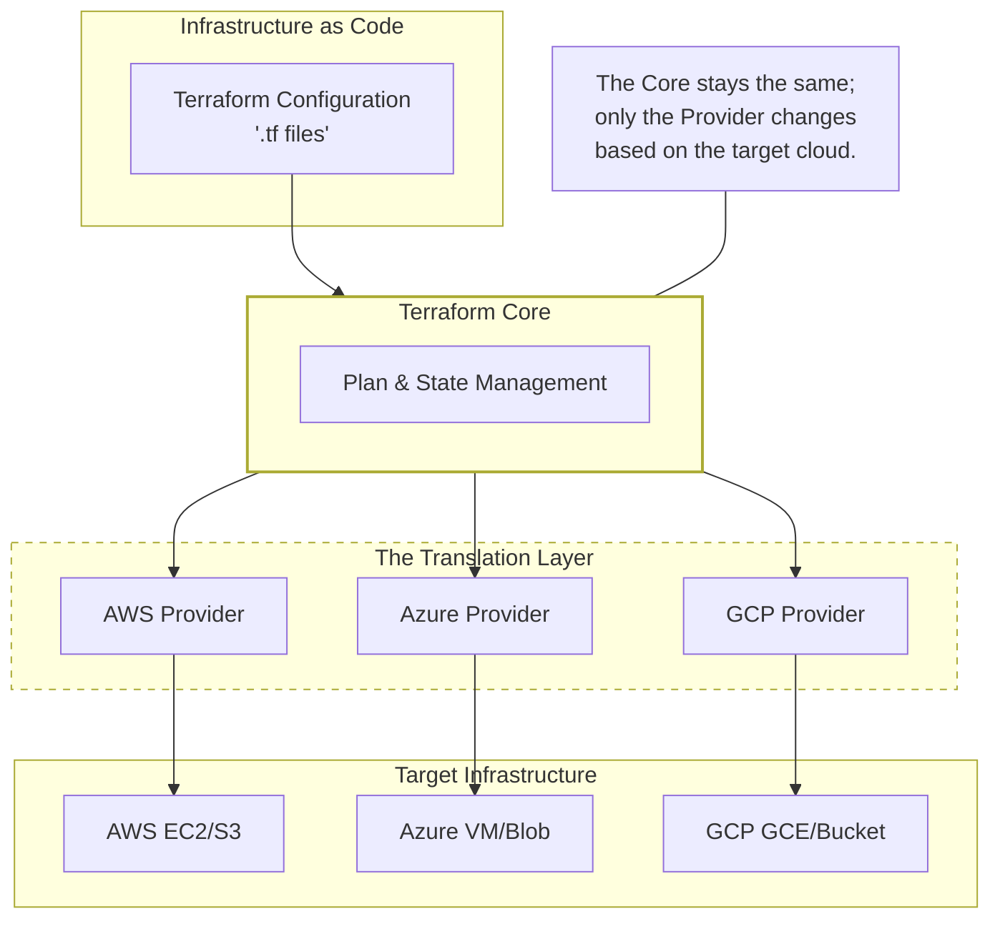
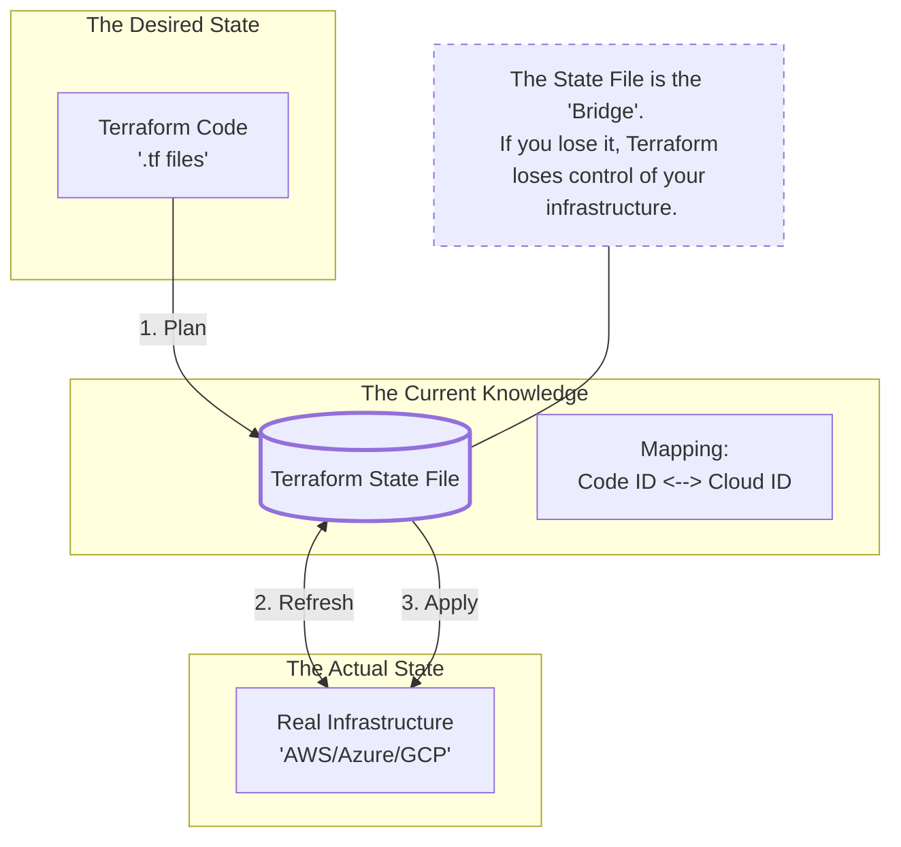
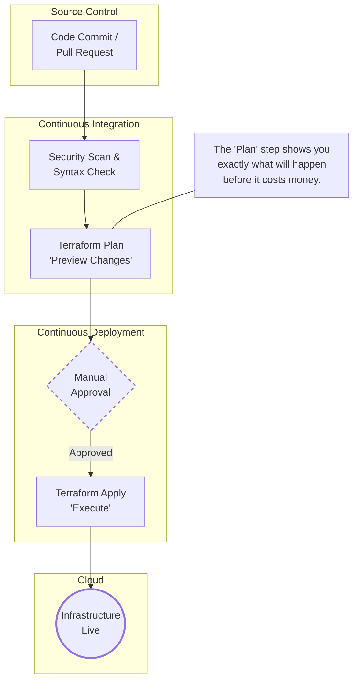

# 01.02 Infrastructure & IaC Fundamentals

## 1. What is Infrastructure?

**Infrastructure** is everything required to **run, secure, and scale an application reliably**.

### Core Infrastructure Components

* **Compute** – Physical or virtual servers (VMs, instances, containers)
* **Networking** – IP addressing, subnets, routing, DNS, load balancers
* **Storage** – Block storage, file systems, object storage
* **Security** – Firewalls, IAM roles, security groups, certificates
* **Operating System & Runtime** – Linux/Windows, libraries, language runtimes

Without infrastructure, **application code is useless**.

### Simple Analogy

| Application World | Real World                      |
| ----------------- | ------------------------------- |
| Application code  | House                           |
| Infrastructure    | Land, water, electricity, roads |

You can design the best house, but **without land and utilities, it cannot exist**.

---

## 2. Infrastructure Models

### 2.1. The Three Infrastructure Types

There are **three main infrastructure models**:

1. On-Premise :

   Infrastructure is **owned, hosted, and managed by the organization** in its own data center. Scaling is manual and costs are upfront.

2. Hybrid : 

   A **combination of on-premise and cloud**, where workloads are split based on security, compliance, or scalability needs.

3. Cloud : 
   
   Infrastructure is **delivered as services over the internet**, provisioned via APIs, scalable on demand, and paid for as you use.

### 2.2 Deep Dive: On-Premise → Hybrid → Cloud

This diagram shows the **key differences between On-Premise, Hybrid, and Cloud infrastructure**:

* **On-Premise:** You manage everything (high cost, manual operations, high manpower)
* **Hybrid:** Shared responsibilities (mixed cost, complex operations, medium manpower)
* **Cloud:** Provider-managed (OpEx, automated operations, low manpower)

### 2.3 Shared Responsibility Model

> **Shared Responsibility Model** explains how management duties are divided between the customer and the cloud provider.

> In a **Hybrid model**, responsibility is split—some layers are managed by you (on-premise) while others are managed by the cloud provider, based on where the workload runs.

* **On-Premise:** You manage everything
* **Hybrid:** Shared control (on-prem + cloud)
* **IaaS:** Provider manages hardware; you manage OS & apps
* **PaaS:** Provider manages platform; you manage code
* **SaaS:** Provider manages everything

---

## 3. Provisioning: What It Means

**Provisioning** is the process of **setting up infrastructure** — servers, networks, storage, and configurations — so applications can run.

There are two types of Provisioning

1. **Manual Provisioning** : Create infra `by click`
2. **Code based Provisioning** : Create infra `by code`

---

---

### 3.1 Problems with Manual Provisioning

Manual provisioning involves:

* Clicking through cloud consoles
* Running ad-hoc CLI commands
* Following undocumented steps

**Why it fails:**

1. **Not Repeatable** – Hard to recreate the same environment exactly
2. **Error-Prone** – Human mistakes multiply as scale increases
3. **No Version Control** – No track of *who changed what and when*
4. **Difficult Rollbacks** – Undoing mistakes is slow and risky
5. **Not Scalable** – Works for 1 server, fails for 100+

> ⚠ Manual provisioning **cannot survive real-world production environments**.

---

### 3.2 Infrastructure as Code (IaC)

* **Automates provisioning** using code, not clicks
* **Repeatable & Consistent** — same environment every time
* **Version-controlled** — track all changes via Git
* **Scalable** — manages hundreds or thousands of resources easily
* **Declarative** — define *what you want*, Terraform figures out *how to do it*

> Terraform turns **manual, error-prone provisioning** into **reliable, automated, and production-ready infrastructure**.
---

## 4. What is Infrastructure as Code (IaC)?

**Infrastructure as Code (IaC)** means:

> Managing infrastructure using **code files** instead of manual steps

### Core Principles of IaC

* Infrastructure is defined in **files**
* Files are stored in **Git**
* Changes go through **review and approval**
* Infrastructure is created automatically

### Benefits of IaC

* Repeatable
* Version‑controlled
* Automated
* Auditable
* Consistent across environments (dev, test, prod)

### IaC Workflow

---

## 5. IaC Tools Overview

### 5.1 Terraform

* Created by **HashiCorp**
* Cloud‑agnostic
* Declarative syntax (HCL)
* Uses a **state file** to track resources

**Best suited for:**

* Multi‑cloud environments
* Standardized infrastructure
* Enterprise‑grade automation

---

### IaC Tool Comparison

Terraform is universal way to create infra for all cloud providers. There are some other IaC tools also prominent as mentioned below :

| Tool           | Cloud Support | Language              |
| -------------- | ------------- | --------------------- |
| Terraform      | Multi‑cloud   | HCL                   |
| CloudFormation | AWS only      | YAML / JSON           |
| ARM / Bicep    | Azure only    | JSON / Bicep          |
| Pulumi         | Multi‑cloud   | Programming languages |

---

## 6. Why Terraform?

Terraform is widely adopted due to **three critical strengths**.

1. **Cloud‑Agnostic**

   * Works across AWS, GCP, Azure, or private clouds
   * Infrastructure code is reusable, not tied to one provider

2. **Declarative Approach**

   * You **define *what* you want**, not *how* to create it
   * Terraform figures out the steps to reach the desired state

3. **State‑Driven Architecture**

   * Maintains a **state file** to track existing resources
   * Ensures changes are **applied incrementally and consistently**
   * Supports **safe updates and rollbacks**
---

### 6.1 Cloud‑Agnostic

* Same tool for AWS, Azure, GCP
* Prevents vendor lock‑in

---

### 6.2 Declarative Approach

You define **what you want**, not **how to do it**.

Example:

* Desired state: `1 virtual machine`
* Terraform calculates the steps automatically

**Benefits:**

* Simpler code
* Predictable behavior
* Fewer procedural errors

---

### 6.3 State‑Driven Architecture

Terraform maintains a **state file** that tracks:

* What resources exist
* Current configuration
* Required changes

> **State is the brain of Terraform** — understanding it is mandatory for real‑world usage.

---

## 7. Terraform in DevOps & CI/CD

Terraform plays a key role in **infrastructure automation**.

### DevOps Pipeline View

### Key Takeaways

* Infrastructure is created **before application deployment**
* Changes are predictable and reviewable
* Environments remain consistent

---

## Final Summary

* Infrastructure is the foundation of applications
* Manual provisioning does not scale
* IaC brings automation, consistency, and safety
* Terraform is the industry standard for IaC

> **Master Terraform → Master modern infrastructure automation**
