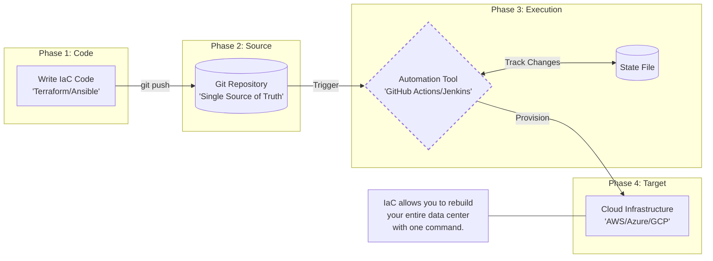
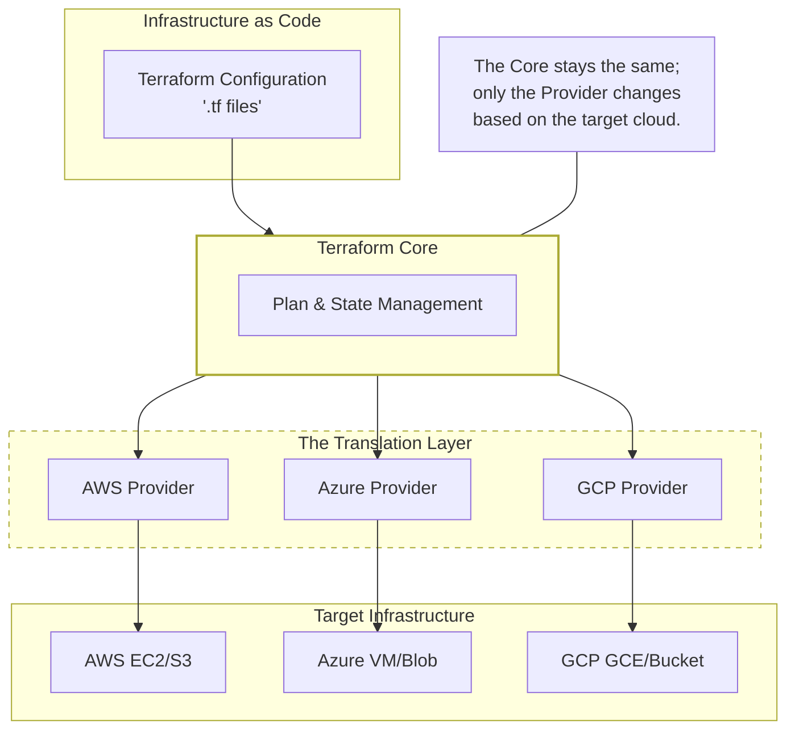
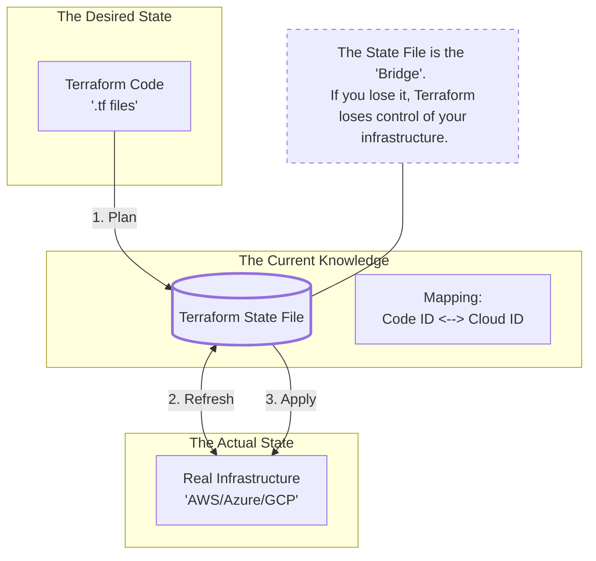
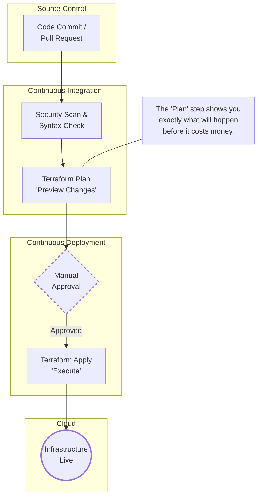

# 01.02 Infrastructure & IaC Fundamentals

## 1. What is Infrastructure?

**Infrastructure** is everything required to **run, secure, and scale an application reliably**.

### Core Infrastructure Components

* **Compute** – Physical or virtual servers (VMs, instances, containers)
* **Networking** – IP addressing, subnets, routing, DNS, load balancers
* **Storage** – Block storage, file systems, object storage
* **Security** – Firewalls, IAM roles, security groups, certificates
* **Operating System & Runtime** – Linux/Windows, libraries, language runtimes

Without infrastructure, **application code is useless**.

### Simple Analogy

| Application World | Real World                      |
| ----------------- | ------------------------------- |
| Application code  | House                           |
| Infrastructure    | Land, water, electricity, roads |

You can design the best house, but **without land and utilities, it cannot exist**.

---

## 2. Traditional Infrastructure vs Cloud Infrastructure

### 2.1 Traditional Infrastructure (On‑Premise)

**How it works:**

* Physical servers hosted in a data center
* Hardware must be ordered, installed, and configured
* Scaling means buying more servers

**Characteristics:**

* Long procurement cycles (weeks/months)
* Manual setup
* Fixed capacity

**Major Problems:**

* Slow provisioning
* High upfront cost (CapEx)
* Difficult to scale
* High operational risk due to manual work

---

### 2.2 Cloud Infrastructure

**How it works:**

* Virtualized resources
* Provisioned using APIs
* Managed by cloud providers

**Characteristics:**

* Infrastructure in minutes
* Pay only for what you use
* Elastic and scalable

**Key Benefits:**

* Fast provisioning
* No hardware management
* Easy horizontal & vertical scaling
* Designed for automation

---

### 2.3 Comparison Table

| Aspect       | Traditional (On‑Prem) | Cloud Infrastructure |
| ------------ | --------------------- | -------------------- |
| Provisioning | Manual                | API‑based            |
| Speed        | Slow                  | Fast (minutes)       |
| Scaling      | Difficult             | Elastic              |
| Cost Model   | Capital Expense       | Operational Expense  |
| Automation   | Limited               | First‑class          |

---

## 3. Problems with Manual Provisioning

Manual provisioning means:

* Clicking through cloud consoles
* Running ad‑hoc CLI commands
* Following undocumented steps

### Why Manual Provisioning Fails

1. **Not Repeatable**

   * Same environment cannot be recreated exactly

2. **Error‑Prone**

   * Human mistakes increase with scale

3. **No Version Control**

   * No history of *who changed what and when*

4. **Difficult Rollbacks**

   * Undoing mistakes is risky and slow

5. **Not Scalable**

   * Works for 1 server, breaks at 100+

> Manual provisioning does **not survive real‑world production environments**.

---

## 4. What is Infrastructure as Code (IaC)?

**Infrastructure as Code (IaC)** means:

> Managing infrastructure using **code files** instead of manual steps

### Core Principles of IaC

* Infrastructure is defined in **files**
* Files are stored in **Git**
* Changes go through **review and approval**
* Infrastructure is created automatically

### Benefits of IaC

* Repeatable
* Version‑controlled
* Automated
* Auditable
* Consistent across environments (dev, test, prod)

### IaC Workflow

---

## 5. IaC Tools Overview

### 5.1 Terraform

* Created by **HashiCorp**
* Cloud‑agnostic
* Declarative syntax (HCL)
* Uses a **state file** to track resources

**Best suited for:**

* Multi‑cloud environments
* Standardized infrastructure
* Enterprise‑grade automation

---

### 5.2 AWS CloudFormation

* AWS‑native IaC tool
* Deep AWS integration

**Limitations:**

* AWS‑only
* Verbose and complex templates

---

### 5.3 ARM / Bicep (Azure)

* Azure native IaC tools
* ARM uses JSON
* Bicep provides cleaner syntax

**Limitations:**

* Azure‑only

---

### 5.4 Pulumi

* Uses real programming languages (Python, Go, TypeScript)
* Developer‑friendly

**Limitations:**

* More complexity
* Less standardization across teams

---

### IaC Tool Comparison

| Tool           | Cloud Support | Language              |
| -------------- | ------------- | --------------------- |
| Terraform      | Multi‑cloud   | HCL                   |
| CloudFormation | AWS only      | YAML / JSON           |
| ARM / Bicep    | Azure only    | JSON / Bicep          |
| Pulumi         | Multi‑cloud   | Programming languages |

---

## 6. Why Terraform?

Terraform is widely adopted due to **three critical strengths**.

---

### 6.1 Cloud‑Agnostic

* Same tool for AWS, Azure, GCP
* Prevents vendor lock‑in

---

### 6.2 Declarative Approach

You define **what you want**, not **how to do it**.

Example:

* Desired state: `1 virtual machine`
* Terraform calculates the steps automatically

**Benefits:**

* Simpler code
* Predictable behavior
* Fewer procedural errors

---

### 6.3 State‑Driven Architecture

Terraform maintains a **state file** that tracks:

* What resources exist
* Current configuration
* Required changes

> **State is the brain of Terraform** — understanding it is mandatory for real‑world usage.

---

## 7. Terraform in DevOps & CI/CD

Terraform plays a key role in **infrastructure automation**.

### DevOps Pipeline View

### Key Takeaways

* Infrastructure is created **before application deployment**
* Changes are predictable and reviewable
* Environments remain consistent

---

## Final Summary

* Infrastructure is the foundation of applications
* Manual provisioning does not scale
* IaC brings automation, consistency, and safety
* Terraform is the industry standard for IaC

> **Master Terraform → Master modern infrastructure automation**

