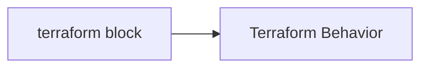
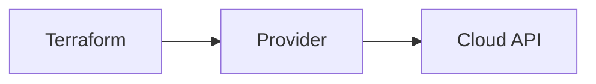
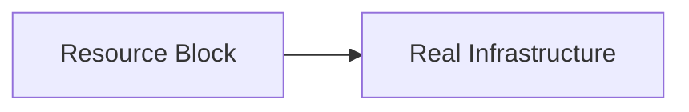
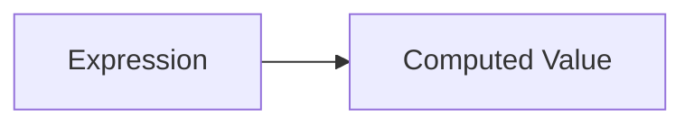

# 01.02 Terraform Language (HCL) Essentials


## 1. What is HCL (HashiCorp Configuration Language)?

HCL is the language used by Terraform to describe infrastructure.

Key characteristics:

* Human-readable
* Declarative
* Structured
* Easy to version control

### Declarative Meaning

You describe **what you want**, not **how to do it**.

Example concept:

* You say: "I need one server"
* Terraform decides the steps

This makes infrastructure predictable and consistent.

---

## 2. Terraform Configuration Files

Terraform reads files with the `.tf` extension.

Important points:

* All `.tf` files in a directory are loaded together
* Order of files does not matter
* Terraform treats them as one configuration

```text
main.tf
provider.tf
variables.tf
outputs.tf
```

---

## 3. Terraform Blocks Overview

Terraform code is written using **blocks**.

General block structure:

```hcl
block_type "label" "name" {
  argument = value
}
```

Every Terraform file is a collection of such blocks.

---

## 4. The `terraform` Block

The `terraform` block is used to configure **Terraform itself**.

Used for:

* Required Terraform version
* Required providers
* Backend configuration

Conceptual example:

* "Terraform, these are your rules before you run"



This block does not create infrastructure.

---

## 5. The `provider` Block

The provider block tells Terraform **which platform to talk to**.

Examples:

* AWS
* Azure
* GCP
* Kubernetes

Concept:

* Provider acts as a bridge between Terraform and APIs



Without a provider, Terraform cannot create resources.

---

## 6. The `resource` Block

The resource block defines **actual infrastructure**.

Examples of resources:

* Virtual machines
* Storage buckets
* Networks

Structure:

```hcl
resource "resource_type" "resource_name" {
  argument = value
}
```

Key points:

* `resource_type` is defined by the provider
* `resource_name` is local to Terraform



---

## 7. Syntax Basics

### 7.1 Blocks

Blocks:

* Are enclosed in `{ }`
* Group related configuration

Example idea:

* A block is like a container

---

### 7.2 Arguments

Arguments are key-value pairs inside blocks.

Example structure:

```hcl
argument_name = value
```

Rules:

* One argument per line
* Equals sign is mandatory

---

### 7.3 Expressions

Expressions compute values.

Examples:

* Referencing another value
* Combining values
* Using functions

Conceptual example:

* Value comes from somewhere else



---

## 8. Comments and Formatting

### Comments

Terraform supports:

* Single-line comments

```hcl
# This is a comment
```

or

```hcl
// This is also a comment
```

Comments help humans, not Terraform.

---

### Formatting

Terraform encourages consistent formatting.

Best practices:

* Use two spaces for indentation
* One argument per line
* Align equals signs (optional)

Terraform provides automatic formatting using tooling (covered later).

---

## 9. File Naming Conventions

Terraform does not enforce file names, but conventions matter.

Common conventions:

* `main.tf` – primary resources
* `providers.tf` – provider configuration
* `variables.tf` – input variables
* `outputs.tf` – output values

Why conventions matter:

* Readability
* Team collaboration
* Production readiness

---

## Phase Outcome

After this phase, you should be able to:

* Read Terraform `.tf` files
* Identify blocks and their purpose
* Understand basic HCL syntax
* Navigate Terraform project structure

---

## Practice Challenges (Phase 2)

1. Identify all blocks in a sample Terraform file.
2. Explain the difference between `terraform`, `provider`, and `resource` blocks.
3. Given a `.tf` file, point out:

   * Blocks
   * Arguments
   * Comments
4. Explain why file naming conventions are important even though Terraform ignores order.
5. Draw a simple diagram showing how Terraform uses providers to create resources.
