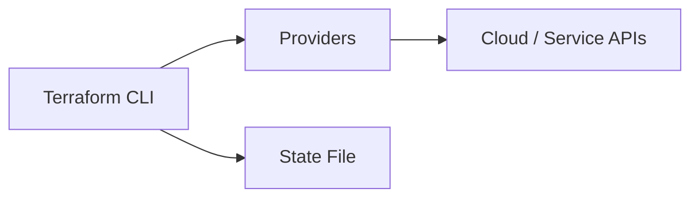

## 01.02 – Terraform Basics & Setup
## 1. What is Terraform?

Terraform is an **Infrastructure as Code (IaC) tool** created by HashiCorp.

In simple terms:

* Terraform allows you to define infrastructure using code
* It creates, updates, and deletes infrastructure safely
* It works with many platforms using a common workflow

Terraform focuses on **infrastructure provisioning**, not application deployment.

Key characteristics:

* Declarative
* Cloud-agnostic
* State-driven

---

## 2. Terraform Architecture

Terraform follows a modular architecture made up of a few core components.

Main components:

* Terraform CLI
* Providers
* State file

### High-level architecture flow



Terraform itself does not talk directly to cloud APIs. Providers act as intermediaries.

---

## 3. Terraform CLI

The Terraform CLI is the command-line tool you interact with.

Responsibilities of the CLI:

* Reads Terraform configuration files
* Builds an execution plan
* Invokes providers
* Manages state

Important point:

* Terraform is a **single binary**
* No background service is required

Mental model:

> Terraform CLI is the brain that coordinates everything

---

## 4. Providers

Providers are plugins used by Terraform to interact with external systems.

Examples:

* AWS provider
* Azure provider
* Kubernetes provider

Provider responsibilities:

* Authenticate with the platform
* Translate Terraform instructions into API calls

Without providers, Terraform cannot manage infrastructure.

---

## 5. State File

The state file is how Terraform **remembers what it manages**.

The state file stores:

* What resources exist
* Resource identifiers
* Metadata required for updates

Why state is critical:

* Prevents duplicate resources
* Enables safe updates
* Allows Terraform to detect drift

At this stage, it is enough to know:

> Terraform decisions are based on state

State will be covered deeply in later phases.

---

## 6. Installing Terraform

Terraform installation involves downloading the CLI binary.

Supported platforms:

* Linux
* Windows
* macOS

General installation steps:

1. Download Terraform binary
2. Place it in system PATH
3. Verify installation

Terraform does not require:

* Databases
* Agents
* Daemons

---

## 7. Terraform CLI Basics

Before writing any code, you should be comfortable with basic Terraform commands.

### `terraform version`

Purpose:

* Confirms Terraform is installed
* Shows Terraform version

Use case:

* Troubleshooting
* Version verification

---

### `terraform help`

Purpose:

* Lists available commands
* Shows usage information

Mental model:

> Built-in documentation for Terraform CLI

---

## 8. Terraform Project Structure

Terraform projects are organized as directories containing `.tf` files.

Important concept:

* All `.tf` files in a directory are treated as one configuration

### Common file structure

```text
project-root/
├── main.tf
├── providers.tf
├── variables.tf
├── outputs.tf
```

---

### `main.tf`

Purpose:

* Contains primary resource definitions
* Acts as the main entry point

---

### `providers.tf`

Purpose:

* Defines provider configurations
* Specifies provider requirements

---

### `variables.tf`

Purpose:

* Declares input variables
* Makes configurations reusable

---

### `outputs.tf`

Purpose:

* Defines values to display after execution
* Used for sharing data between modules

---

## Phase Outcome

After completing this phase, you should be able to:

* Explain what Terraform is and what it is used for
* Understand Terraform’s core components
* Install Terraform successfully
* Navigate a basic Terraform project structure

You are now ready to start reading and writing Terraform configuration files.

---

## Practice Challenges – Phase 1

1. Explain Terraform in one paragraph without using the term “IaC”.
2. Describe the role of the Terraform CLI in the architecture.
3. Why are providers required for Terraform to work?
4. In your own words, explain why Terraform needs a state file.
5. Create a folder structure for a Terraform project and explain the purpose of each file.

---

**Next Phase:** Terraform Language (HCL) Essentials
