```mermaid
flowchart LR
    TF[Terraform Core] --> AWS[AWS Provider]
    TF --> AZ[Azure Provider]
    TF --> GCP[GCP Provider]
    TF --> K8S[Kubernetes Provider]

    AWS --> AWSR[Cloud Resources\nEC2 • S3 • IAM]
    AZ --> AZR[Cloud Resources\nVM • VNet]
    GCP --> GCPR[Cloud Resources\nCompute • Storage]
    K8S --> K8SR[Kubernetes Objects\nPods • Services]
```

## 01.03 – Terraform Basics & Setup

## 1. What is Terraform?

Terraform is an **Infrastructure as Code (IaC) tool** created by HashiCorp.

In simple terms:

* Terraform allows you to define infrastructure using code
* It creates, updates, and deletes infrastructure safely
* It works with many platforms using a common workflow

Terraform focuses on **infrastructure provisioning**, not application deployment.It does not require:

* Databases
* Agents
* Daemons

Key characteristics of terraform :

* Declarative
* Cloud-agnostic
* State-driven

---

## 2. Terraform Architecture

Terraform follows a modular architecture made up of a few core components.

### The Three Pillars:

* Terraform CLI
* Providers
* State file

### High-Level Workflow


Terraform itself does not talk directly to cloud APIs. Providers act as intermediaries.

## 2.1. Terraform CLI

The Terraform CLI is the command-line tool you interact with.

Responsibilities of the CLI:

* Reads Terraform configuration files
* Builds an execution plan
* Invokes providers
* Manages state

Important point:

* Terraform is a **single binary**
* No background service is required


---

## 2.2 Providers

Providers are plugins used by Terraform to interact with external cloud systems.

Examples:

* AWS provider
* Azure provider
* Kubernetes provider

Provider responsibilities:

* Authenticate with the platform
* Translate Terraform instructions into API calls

Without providers, Terraform cannot manage infrastructure.

---

## 2.3 State File

The state file is how Terraform **remembers what it manages**.

The state file stores:

* What resources exist
* Resource identifiers
* Metadata required for updates

Why state is critical:

* Prevents duplicate resources
* Enables safe updates
* Allows Terraform to detect drift

At this stage, it is enough to know:

> Terraform decisions are based on state

State will be covered deeply in later phases.

---

---

## 3. Terraform CLI Basics

Before writing any code, you should be comfortable with basic Terraform commands.

Terraform cmds from initialisation to destroy in the cmd based flow

```mermaid
sequenceDiagram
    autonumber

    participant User as User
    participant CLI as Terraform CLI
    participant Cloud as Cloud

    Note over User: Step 1 – Write Code
    User->>CLI: Create .tf files

    Note over User,CLI: Step 2 – Initialize
    User->>CLI: terraform init
    CLI-->>User: Providers ready

    Note over User,CLI: Step 3 – Validate
    User->>CLI: terraform validate
    CLI-->>User: Configuration OK

    Note over User,CLI: Step 4 – Plan
    User->>CLI: terraform plan
    CLI-->>User: Show changes

    Note over User,CLI: Step 5 – Apply
    User->>CLI: terraform apply
    CLI->>Cloud: Create infrastructure
    Cloud-->>CLI: Resources created
    CLI-->>User: Done

    Note over User,CLI: Step 6 – Destroy (Optional)
    User->>CLI: terraform destroy
    CLI->>Cloud: Delete resources
```


---
> Note : Remebering the cmds only make sense when its functionality is clearly understood in first place along with flow as mentioned in the above diagram. 

```yaml
1. terraform init        # Initializes the Terraform project, downloads providers, and prepares the working directory
2. terraform fmt         # Formats Terraform configuration files to standard style
3. terraform validate    # Checks Terraform files for syntax and basic configuration errors
4. terraform plan        # Shows what infrastructure Terraform will create, update, or delete (dry run)
5. terraform apply       # Creates or updates real infrastructure based on the plan
6. terraform output      # Displays output values like IP addresses, DNS names, or resource IDs
7. terraform show        # Displays current state or a saved plan in a human-readable format
8. terraform state list  # Lists all resources tracked in the Terraform state file
9. terraform destroy     # Deletes all infrastructure managed by the Terraform configuration
```

---

## 4. Terraform Project Structure

Terraform projects are organized as directories containing `.tf` files.

> Important concept : All `.tf` files in a directory are treated as one configuration

### Common file structure

```yaml
project-root/
├── main.tf        # Defines the main infrastructure resources (entry point)
├── providers.tf   # Configures cloud providers and required provider versions
├── variables.tf   # Declares input variables for reusability and flexibility
├── outputs.tf     # Exposes useful values after apply (IPs, IDs, DNS, etc.)
```

### Simple mental model

* **main.tf** → *What to create*
* **providers.tf** → *Where to create*
* **variables.tf** → *Make it configurable*
* **outputs.tf** → *What to show after creation*

### Real time folder structure

```mermaid
flowchart LR
    %% Root Directory
    Root(["📂 terraform-project/"])

    %% Main Branches
    Root --- Modules(["📂 modules/"])
    Root --- Envs(["📂 envs/"])
    Root --- Git([".gitignore"])

    %% Modules Sub-structure
    subgraph Modules_Logic [Blueprint Library]
        direction LR
        Modules ~~~ VPC(["📂 vpc/"])
        Modules ~~~ EC2(["📂 ec2/"])
        
        VPC --- V_files["main.tf<br/>variables.tf<br/>outputs.tf"]
        EC2 --- E_files["main.tf<br/>variables.tf<br/>outputs.tf"]
    end

    %% Environments Sub-structure
    subgraph Execution_Layers [Environment Deployments]
        direction LR
        Envs ~~~ Dev(["📂 dev/"])
        Envs ~~~ Prod(["📂 prod/"])
        
        Dev --- D_files["main.tf<br/>backend.tf<br/>terraform.tfvars"]
        Prod --- P_files["main.tf<br/>backend.tf<br/>terraform.tfvars"]
    end

    %% Smooth curve links showing module inheritance
    Dev -.->|Interprets| VPC
    Dev -.->|Interprets| EC2
    Prod -.->|Interprets| VPC
    Prod -.->|Interprets| EC2
```



## A. Terraform Module

A **Terraform Module** is a reusable collection of Terraform code that defines related infrastructure resources.

* Groups multiple resources together
* Written once and reused across environments
* Does not create infrastructure by itself

**Purpose:**

* Avoid code duplication
* Enforce standard infrastructure patterns
* Improve maintainability

**Key Rule:**

* Modules must be **generic**
* Use variables instead of hardcoded values

**Location:**

* Typically stored in `modules/`


## B. Terraform Environment

A **Terraform Environment** is where modules are called with real values to create infrastructure.

* Represents a lifecycle stage (dev, test, prod)
* Supplies environment-specific values
* Creates and manages real resources

**Purpose:**

* Isolate environments
* Prevent impact across stages
* Allow different configurations per environment

**Location:**

* Typically stored in `envs/` or `live/`


## Summary

* **Module** → Defines infrastructure logic
* **Environment** → Applies that logic with real values

---

## 5. Terraform Providers

**Terraform providers** are plugins that allow Terraform to **interact with external platforms** such as cloud providers using APIs, SaaS tools, and on-prem systems.


> A Terraform provider is the **bridge between Terraform and the real world**, converting infrastructure code into API actions.

### What Providers Do

* **Providers** act as plugins
* **Terraform Core** reads your `.tf` code
* Authenticate with the target platform
* Providers convert code into **API calls**
* APIs create/manage **real resources**

### Examples

* **AWS Provider** → EC2, S3, IAM
* **Azure Provider** → Virtual Machines, VNets
* **GCP Provider** → Compute Engine, Cloud Storage
* **Kubernetes Provider** → Pods, Services, Deployments
---


---

## 6. Terraform State File

The **Terraform state file** (`terraform.tfstate`) is the source of truth that tracks **what infrastructure Terraform has created** and **its current real-world state** like on cloud.

> Terraform state files keep Terraform and real infrastructure **in sync**.

---

### Why State Files Exist

* Map Terraform resources to **actual cloud resources**
* Track **dependencies** between resources
* Enable Terraform to **calculate changes** (create, update, delete)
* Prevent duplicate or conflicting resources

---

### What State Files Contain

* Resource IDs and metadata
* Current configuration values
* Dependency relationships
* Provider-specific details

> ⚠️ State files **may contain sensitive data** (passwords, secrets).

---

### How Terraform Uses State

* **terraform plan** → Compares desired config vs state
* **terraform apply** → Updates state after changes
* **terraform destroy** → Uses state to safely delete resources

---

### Local vs Remote State

| Type         | Description                                     |
| ------------ | ----------------------------------------------- |
| Local State  | Stored on a local machine (default)             |
| Remote State | Stored in shared backends (S3, GCS, Azure Blob) |

---


