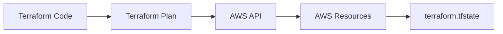
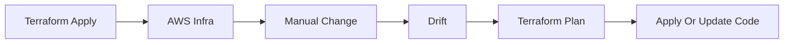

# Terraform Basics — Complete Beginner Guide

## What is Terraform

Terraform is an **Infrastructure as Code (IaC)** tool.

* You **write code**
* Terraform **creates AWS infrastructure**
* Terraform **tracks infra state**
* Terraform **detects changes (drift)**

---

# Basic Terraform Files

### Minimal EC2 project

```text
terraform-ec2/
├── main.tf
├── variables.tf
├── outputs.tf
└── terraform.tfstate   (auto-created)
```

---

## `main.tf` (Infrastructure Definition)

```hcl
terraform {
  required_providers {
    aws = {
      source  = "hashicorp/aws"
      version = "~> 5.0"
    }
  }
}

provider "aws" {
  region = var.region
}

resource "aws_instance" "example" {
  ami           = var.ami_id
  instance_type = var.instance_type

  tags = {
    Name = "terraform-ec2"
  }
}
```

👉 This file answers:

* **WHAT** to create (EC2)
* **WHERE** to create (AWS region)
* **HOW** to configure it

---

## 📄 `variables.tf` (Inputs)

```hcl
variable "region" {
  default = "us-east-1"
}

variable "ami_id" {
  default = "ami-0c02fb55956c7d316"
}

variable "instance_type" {
  default = "t2.micro"
}
```

👉 Makes code reusable and clean

---

## 📄 `outputs.tf` (Results)

```hcl
output "instance_id" {
  value = aws_instance.example.id
}

output "public_ip" {
  value = aws_instance.example.public_ip
}
```

👉 Shows useful info after creation

---

# ▶️ Terraform Workflow (Very Important)

### Step 1: Initialize

```bash
terraform init
```

* Downloads AWS provider
* Creates `.terraform/` directory

---

### Step 2: Plan

```bash
terraform plan
```

Terraform:

* Reads code
* Compares with **tfstate**
* Shows **what will change**

👉 No infra created yet

---

### Step 3: Apply

```bash
terraform apply
```

* Calls AWS APIs
* Creates EC2
* Updates **tfstate**

---

### Step 4: Destroy

```bash
terraform destroy
```

* Deletes infra
* Updates **tfstate**

---

# 🗂️ What is `terraform.tfstate`

### Very simple explanation:

> **tfstate = Terraform’s memory**

Terraform **does NOT ask AWS everything every time**.
It relies on **tfstate** to know:

* What exists
* Resource IDs
* Current configuration

---

## What tfstate contains

* EC2 instance ID
* AMI used
* Instance type
* Tags
* Networking details

⚠️ It may contain **sensitive data**

---

## Example (simplified)

```json
{
  "resources": [
    {
      "type": "aws_instance",
      "name": "example",
      "instances": [
        {
          "attributes": {
            "instance_type": "t2.micro",
            "id": "i-0123456789"
          }
        }
      ]
    }
  ]
}
```

---

## ⚠️ Important tfstate rules

* ❌ NEVER edit manually
* ❌ NEVER commit to Git
* ✅ Store remotely for teams (S3 + DynamoDB)

---

# 🔄 How Code → Infra Works Internally



(single-line labels, VS Code safe ✅)

---

# 🧨 What is Drift

**Drift = Infra changed outside Terraform**

### Example:

* Terraform created EC2 as `t2.micro`
* Someone manually changes it to `t3.micro` in AWS Console

Terraform **does not know** until next plan.

---

## Drift Detection

```bash
terraform plan
```

Terraform:

* Reads tfstate
* Reads real AWS infra
* Finds mismatch

Example output:

```text
~ instance_type: "t3.micro" → "t2.micro"
```

---

## Drift Resolution Options

### Option 1️⃣ Revert AWS to code (most common)

```bash
terraform apply
```

Terraform enforces **code as source of truth**

---

### Option 2️⃣ Accept AWS change

Update code:

```hcl
instance_type = "t3.micro"
```

Then:

```bash
terraform apply
```

---

## Drift Flow Diagram



---

# 🛡️ Best Practices for Beginners

### DO

* Use `terraform plan` before apply
* Use variables
* Destroy infra after practice
* Keep infra simple

### DON’T

* Don’t change infra manually
* Don’t edit tfstate
* Don’t hardcode credentials
* Don’t commit tfstate

---

# 🚀 Beginner → Next Level Path

1. Local tfstate ✅
2. Remote tfstate (S3)
3. IAM Role for Terraform
4. Modules
5. CI/CD
6. Multi-account infra

---

## 🏁 Final Mental Model

> **Terraform Code = Desired State**
> **AWS Infra = Actual State**
> **tfstate = Terraform Memory**
> **plan = Difference Detector**
> **apply = State Enforcer**

---

If you want next, I can:

* 🔐 Explain **remote tfstate with S3**
* 🧩 Convert this to **module**
* 🚀 Show **Terraform + CI/CD**
* 🧪 Create **intentionally drifting infra demo**

Just tell me what’s next 👊
