## 01.02 – Terraform Basics & Setup

## 1. What is Terraform?

Terraform is an **Infrastructure as Code (IaC) tool** created by HashiCorp.

In simple terms:

* Terraform allows you to define infrastructure using code
* It creates, updates, and deletes infrastructure safely
* It works with many platforms using a common workflow

Terraform focuses on **infrastructure provisioning**, not application deployment.

Key characteristics:

* Declarative
* Cloud-agnostic
* State-driven

---

## 2. Terraform Architecture

Terraform follows a modular architecture made up of a few core components.

### The Three Pillars:

1. **Terraform CLI:** The "Brain." A single binary that reads your code and coordinates with plugins.
2. **Providers:** The "Translators." Plugins (like the AWS Provider) that translate Terraform code into specific API calls for that cloud.
3. **State File:** The "Memory." A JSON file (`terraform.tfstate`) that maps your code to the real resources in the cloud.

### High-Level Workflow


## 2.1. Terraform CLI

The Terraform CLI is the command-line tool you interact with.

Responsibilities of the CLI:

* Reads Terraform configuration files
* Builds an execution plan
* Invokes providers
* Manages state

Important point:

* Terraform is a **single binary**
* No background service is required

Mental model:

> Terraform CLI is the brain that coordinates everything

---

## 2.2 Providers

Providers are plugins used by Terraform to interact with external cloud systems.

Examples:

* AWS provider
* Azure provider
* Kubernetes provider

Provider responsibilities:

* Authenticate with the platform
* Translate Terraform instructions into API calls

Without providers, Terraform cannot manage infrastructure.

---

## 2.3 State File

The state file is how Terraform **remembers what it manages**.

The state file stores:

* What resources exist
* Resource identifiers
* Metadata required for updates

Why state is critical:

* Prevents duplicate resources
* Enables safe updates
* Allows Terraform to detect drift

At this stage, it is enough to know:

> Terraform decisions are based on state

State will be covered deeply in later phases.

---

## Installing Terraform

Terraform installation involves downloading the CLI binary.

Supported platforms:

* Linux
* Windows
* macOS

General installation steps:

1. Download Terraform binary
2. Place it in system PATH
3. Verify installation

Terraform does not require:

* Databases
* Agents
* Daemons

---

## 9. Setting Up Linux Using WSL (Windows Users)


Terraform is best learned on Linux.

### Step 1: Enable WSL

Open **PowerShell as Administrator** and run:

```powershell
wsl --list --verbose  # Check the wsl installed
wsl --install # Skip this if installed
```

This will:

* Enable WSL
* Install Ubuntu by default
* Enable required Windows features

Restart your system when prompted.

---

### Step 2: Launch Ubuntu

After reboot:

* Open **Start Menu**
* Search for **Ubuntu**
* Launch it

First-time setup:

* Set a **Linux username**
* Set a **password**

Now you are inside a **Linux terminal**.

Verify:

```bash
uname -a
```

If you see Linux output, WSL is working.

---

### Step 3: Update Linux System

Always update before installing tools:

```yaml
sudo apt update && sudo apt upgrade -y
```

---

## 10. Installing Terraform on Linux (WSL Ubuntu)

We’ll use the **official HashiCorp repository** (recommended way).

### Step 1: Install required packages

```yaml
sudo apt install -y gnupg software-properties-common curl
```
**What the command does**

Installs **gnupg** (verify software authenticity), **software-properties-common** (manage apt repositories), and **curl** (download files).

The `-y` flag auto-confirms the install so it runs without prompts.

**Is it safe?**

Yes—these are official Ubuntu packages and standard tools used by DevOps software.

They actually *increase* security by enabling signature verification and safe downloads.

---

### Step 2: Add HashiCorp GPG key

```bash
curl -fsSL https://apt.releases.hashicorp.com/gpg | sudo gpg --dearmor -o /usr/share/keyrings/hashicorp-archive-keyring.gpg
```

**What this command does**

It downloads HashiCorp’s official GPG signing key using `curl` and converts it into a format (`.gpg`) that APT can use to verify packages.

**Why it matters**
This ensures any HashiCorp software you install (like Terraform) is authentic and hasn’t been tampered with, protecting you from malicious or fake packages.

---

### Step 3: Add HashiCorp repository

```bash
echo "deb [signed-by=/usr/share/keyrings/hashicorp-archive-keyring.gpg] https://apt.releases.hashicorp.com $(lsb_release -cs) main" | sudo tee /etc/apt/sources.list.d/hashicorp.list
```

**What this command does**

It adds HashiCorp’s official APT repository to your system and links it to the trusted GPG key, using your Ubuntu version automatically.

**Why it matters**

This lets you install and update HashiCorp tools securely through `apt`, just like any other official system package.


---

### Step 4: Install Terraform

```bash
sudo apt update && sudo apt install terraform -y
```

---

### Step 5: Verify Installation

```bash
terraform version
```

Expected output (example):

```text
Terraform v1.x.x
```

If you see the version → Terraform is installed correctly

---


## 3. Terraform CLI Basics

Before writing any code, you should be comfortable with basic Terraform commands.

```yaml
1. terraform init        # Initializes the Terraform project, downloads providers, and prepares the working directory
2. terraform fmt         # Formats Terraform configuration files to standard style
3. terraform validate    # Checks Terraform files for syntax and basic configuration errors
4. terraform plan        # Shows what infrastructure Terraform will create, update, or delete (dry run)
5. terraform apply       # Creates or updates real infrastructure based on the plan
6. terraform output      # Displays output values like IP addresses, DNS names, or resource IDs
7. terraform show        # Displays current state or a saved plan in a human-readable format
8. terraform state list  # Lists all resources tracked in the Terraform state file
9. terraform destroy     # Deletes all infrastructure managed by the Terraform configuration
```

Purpose:

* Lists available commands
* Shows usage information

 ### Sequence diagram:

```mermaid
sequenceDiagram
    autonumber

    participant User as User
    participant CLI as Terraform CLI
    participant Cloud as Cloud

    Note over User: Step 1 – Write Code
    User->>CLI: Create .tf files

    Note over User,CLI: Step 2 – Initialize
    User->>CLI: terraform init
    CLI-->>User: Providers ready

    Note over User,CLI: Step 3 – Validate
    User->>CLI: terraform validate
    CLI-->>User: Configuration OK

    Note over User,CLI: Step 4 – Plan
    User->>CLI: terraform plan
    CLI-->>User: Show changes

    Note over User,CLI: Step 5 – Apply
    User->>CLI: terraform apply
    CLI->>Cloud: Create infrastructure
    Cloud-->>CLI: Resources created
    CLI-->>User: Done

    Note over User,CLI: Step 6 – Destroy (Optional)
    User->>CLI: terraform destroy
    CLI->>Cloud: Delete resources
```



---

## 8. Terraform Project Structure

Terraform projects are organized as directories containing `.tf` files.

Important concept:

* All `.tf` files in a directory are treated as one configuration

### Common file structure

```yaml
project-root/
├── main.tf        # Defines the main infrastructure resources (entry point)
├── providers.tf   # Configures cloud providers and required provider versions
├── variables.tf   # Declares input variables for reusability and flexibility
├── outputs.tf     # Exposes useful values after apply (IPs, IDs, DNS, etc.)
```

### Simple mental model

* **main.tf** → *What to create*
* **providers.tf** → *Where to create*
* **variables.tf** → *Make it configurable*
* **outputs.tf** → *What to show after creation*

### Real time folder structure

```mermaid
flowchart LR
    %% Root Directory
    Root(["📂 terraform-project/"])

    %% Main Branches
    Root --- Modules(["📂 modules/"])
    Root --- Envs(["📂 envs/"])
    Root --- Git([".gitignore"])

    %% Modules Sub-structure
    subgraph Modules_Logic [Blueprint Library]
        direction LR
        Modules ~~~ VPC(["📂 vpc/"])
        Modules ~~~ EC2(["📂 ec2/"])
        
        VPC --- V_files["main.tf<br/>variables.tf<br/>outputs.tf"]
        EC2 --- E_files["main.tf<br/>variables.tf<br/>outputs.tf"]
    end

    %% Environments Sub-structure
    subgraph Execution_Layers [Environment Deployments]
        direction LR
        Envs ~~~ Dev(["📂 dev/"])
        Envs ~~~ Prod(["📂 prod/"])
        
        Dev --- D_files["main.tf<br/>backend.tf<br/>terraform.tfvars"]
        Prod --- P_files["main.tf<br/>backend.tf<br/>terraform.tfvars"]
    end

    %% Smooth curve links showing module inheritance
    Dev -.->|Interprets| VPC
    Dev -.->|Interprets| EC2
    Prod -.->|Interprets| VPC
    Prod -.->|Interprets| EC2
```



## A. Terraform Module

A **Terraform Module** is a reusable collection of Terraform code that defines related infrastructure resources.

* Groups multiple resources together
* Written once and reused across environments
* Does not create infrastructure by itself

**Purpose:**

* Avoid code duplication
* Enforce standard infrastructure patterns
* Improve maintainability

**Key Rule:**

* Modules must be **generic**
* Use variables instead of hardcoded values

**Location:**

* Typically stored in `modules/`


## B. Terraform Environment

A **Terraform Environment** is where modules are called with real values to create infrastructure.

* Represents a lifecycle stage (dev, test, prod)
* Supplies environment-specific values
* Creates and manages real resources

**Purpose:**

* Isolate environments
* Prevent impact across stages
* Allow different configurations per environment

**Location:**

* Typically stored in `envs/` or `live/`


## Summary

* **Module** → Defines infrastructure logic
* **Environment** → Applies that logic with real values

---

## 12. Terraform CLI Commands (Beginner Level)

These commands **do NOT create cloud resources** yet — safe to practice.

### `terraform version`

```bash
terraform version
```

Use:

* Confirm installation
* Check version compatibility

---

### `terraform help`

```bash
terraform help
```

Shows:

* All available Terraform commands
* Built-in documentation

---

### `terraform init` (Safe to run anytime)

Create a folder and run:

```bash
mkdir terraform-demo
cd terraform-demo
terraform init
```

What this does:

* Initializes Terraform
* Prepares working directory
* No cloud resources created

Mental model:

> `init` prepares Terraform to work

---

### `terraform validate`

After creating a `.tf` file:

```bash
terraform validate
```

Checks:

* Syntax errors
* Basic configuration issues

No infrastructure impact.

---

### `terraform fmt`

```bash
terraform fmt
```

Automatically:

* Formats Terraform files
* Makes code readable and standard

---

## 13. Minimal Practice Setup (No Cloud Needed)

Create a file:

```bash
touch main.tf
```

Add this minimal content:

```hcl
terraform {
  required_version = ">= 1.0"
}
```

Run:

```bash
terraform init
terraform validate
terraform fmt
```

You have now:

* Written Terraform code
* Initialized Terraform
* Validated configuration

---


## Practice Challenges – Phase 1

1. Explain Terraform in one paragraph without using the term “IaC”.
2. Describe the role of the Terraform CLI in the architecture.
3. Why are providers required for Terraform to work?
4. In your own words, explain why Terraform needs a state file.
5. Create a folder structure for a Terraform project and explain the purpose of each file.
