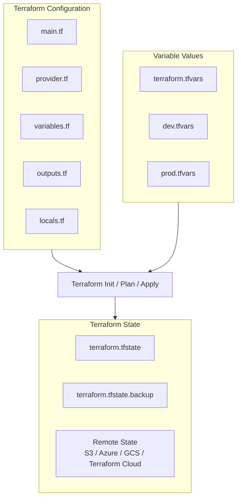

# 02.01 Terraform Language (HCL) Essentials


## 1. What is HCL (HashiCorp Configuration Language)?

HCL is the language used by Terraform to describe infrastructure.

Key characteristics:

* Human-readable
* Declarative
* Structured
* Easy to version control

### Declarative Meaning

You describe **what you want**, not **how to do it**.

Example concept:

* You say: "I need one server"
* Terraform decides the steps

This makes infrastructure predictable and consistent.

---
## 2. Terraform Configuration Files

Terraform reads configuration and data from multiple file types, each serving a specific purpose.

---

### 2.1 `.tf` – Terraform Configuration Files

Terraform reads all files with the **`.tf`** extension in a directory.

**Important points:**

* All `.tf` files in a directory are loaded together
* Order of files does not matter
* Terraform treats them as one configuration
* Logical separation is only for human readability

**Common examples:**

```text
main.tf        → resources
provider.tf   → providers & backend
variables.tf  → input variables
outputs.tf    → outputs
locals.tf     → local values
```

---

### 2.2 `.tfvars` – Variable Values Files

Files with the **`.tfvars`** extension provide **values for variables** defined in `.tf` files.

**Important points:**

* Used to override default variable values
* Helpful for environment-specific configs (dev, stage, prod)
* Loaded automatically if named:

  * `terraform.tfvars`
  * `*.auto.tfvars`

**Examples:**

```text
terraform.tfvars
dev.tfvars
prod.tfvars
```

Usage:

```bash
terraform apply -var-file="dev.tfvars"
```

---

### 2.3 `.tfstate` – Terraform State File

The **`.tfstate`** file stores Terraform’s **current view of the infrastructure**.

**Important points:**

* Maps Terraform resources to real infrastructure
* Used to detect changes (diff)
* Should never be manually edited
* Contains sensitive data (secrets, IPs, IDs)

**Common files:**

```text
terraform.tfstate
terraform.tfstate.backup
```

---

### 2.4 Remote State (Recommended)

Instead of local `.tfstate`, production setups store state remotely.

**Common backends:**

* AWS S3 + DynamoDB (locking)
* Azure Blob Storage
* Google Cloud Storage
* Terraform Cloud / Enterprise

Example:

```hcl
terraform {
  backend "s3" {
    bucket         = "tf-state-bucket"
    key            = "prod/terraform.tfstate"
    region         = "ap-south-1"
    dynamodb_table = "terraform-locks"
  }
}
```

---

### 2.5 File Types Summary

| Extension         | Purpose                      |
| ----------------- | ---------------------------- |
| `.tf`             | Terraform configuration      |
| `.tfvars`         | Variable values              |
| `.auto.tfvars`    | Auto-loaded variable values  |
| `.tfstate`        | Current infrastructure state |
| `.tfstate.backup` | Previous state backup        |
| `.terraform/`     | Provider & module cache      |

---

### 2.6 Best Practices

* Commit `.tf` files to Git
* **Never commit `.tfstate` or `.tfvars` with secrets**
* Use remote state for teams
* Separate environments using different `.tfvars`


### 2.7. Workflow of the Configuration files

* All `.tf` files are **merged into one configuration**
* `.tfvars` files **inject values** into variables
* Terraform compares **desired state (config)** with **current state (.tfstate)**
* State can be **local or remote**
* Output of `apply` updates the state


---
