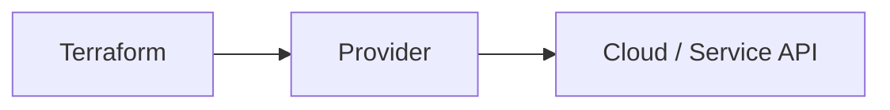
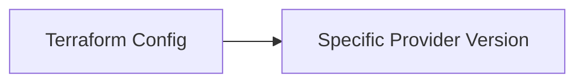
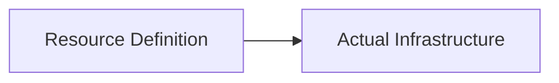
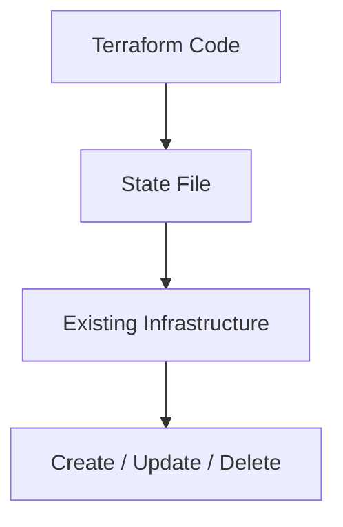
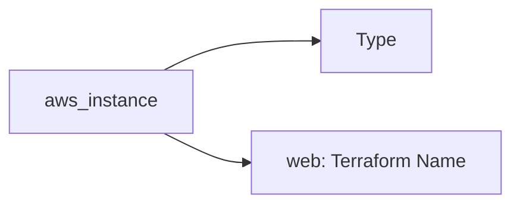

## 02.01 Providers & Resources


## 1. What is a Provider?

A **provider** is a plugin that allows Terraform to interact with an external platform.

Examples of platforms:

* AWS
* Azure
* GCP
* Kubernetes
* GitHub

### Simple explanation

Terraform itself cannot create anything.

A provider:

* Understands the platform APIs
* Translates Terraform instructions into API calls



Without a provider, Terraform cannot manage infrastructure.

---

## 2. Provider Configuration

Provider configuration tells Terraform **how to connect** to a platform.

Typical configuration includes:

* Region
* Credentials (directly or via environment)
* Platform-specific settings

Conceptual example:

* "Use AWS"
* "Connect to this region"

Important points:

* Providers are configured once
* Multiple resources can use the same provider

---

## 3. Provider Version Constraints

Providers evolve over time.

Version constraints ensure:

* Stability
* Predictable behavior
* Avoid breaking changes

Why version constraints matter:

* New provider versions may change behavior
* Old configurations may break

Mental model:

> Lock the provider version just like application dependencies



Version constraints are usually defined in Terraform settings (covered deeply later).

---

## 4. What is a Resource?

A **resource** represents a real infrastructure object.

Examples:

* Virtual machine
* Storage bucket
* Network
* Database

Each resource:

* Has a type
* Has a local name
* Maps to a real object



Terraform manages resources using state, not guesses.

---

## 5. Resource Lifecycle Basics

Every resource goes through a lifecycle.

Basic lifecycle stages:

1. Create
2. Update
3. Delete

Terraform decides the action by comparing:

* Desired configuration
* Current state



Important idea:

* Terraform does not blindly recreate resources
* It changes only what is required

---

## 6. Understanding Resource Naming

Example:

```hcl
resource "aws_instance" "web" {}
```

Breakdown:

### `aws_instance`

* Resource type
* Defined by the provider
* Tells Terraform *what kind* of resource to create

### `web`

* Logical name inside Terraform
* Used for references
* Not visible in the cloud console

Mental model:

* `aws_instance` → What it is
* `web` → What you call it in Terraform



Multiple resources can have the same type but different names.

---

## Phase Outcome

After completing this phase, you should be able to:

* Explain what a provider does
* Understand how Terraform communicates with cloud platforms
* Identify and read resource blocks
* Understand how Terraform manages resource lifecycle

This is the foundation for writing real Terraform code.

---

## Practice Challenges

1. Explain the role of a provider in your own words.
2. Why does Terraform need providers even though cloud APIs already exist?
3. Identify the resource type and resource name in a sample Terraform file.
4. Explain what happens when Terraform detects a difference between configuration and state.
5. Draw a simple flow showing how Terraform creates a resource using a provider.

---
