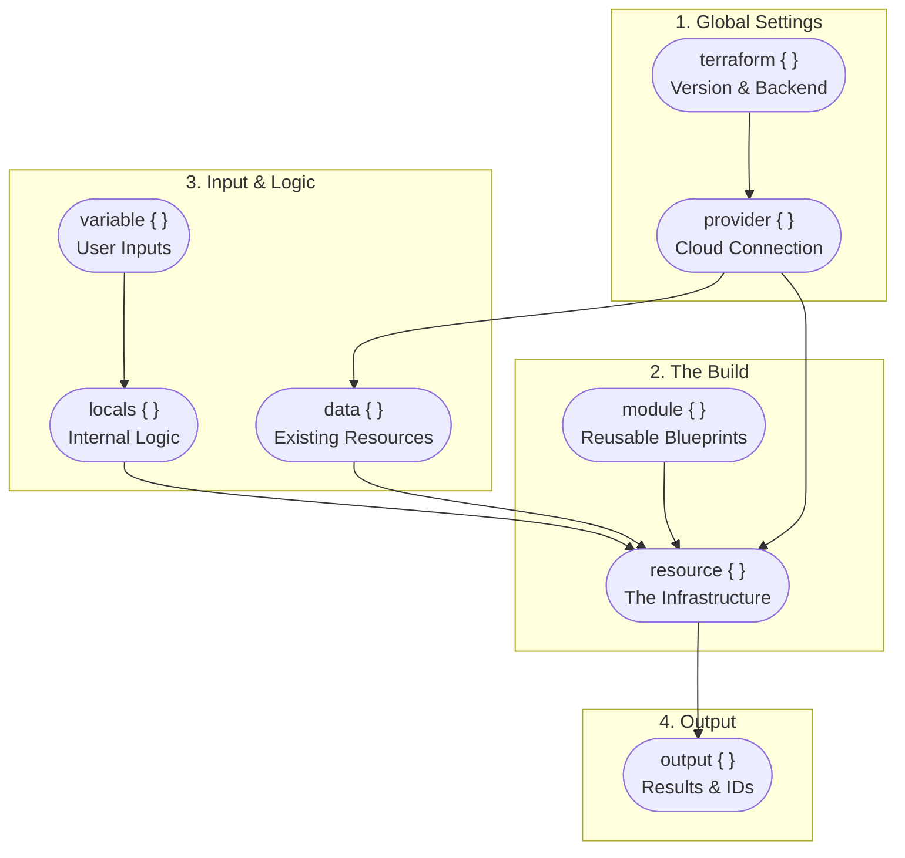
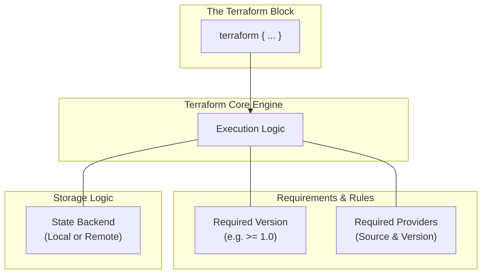
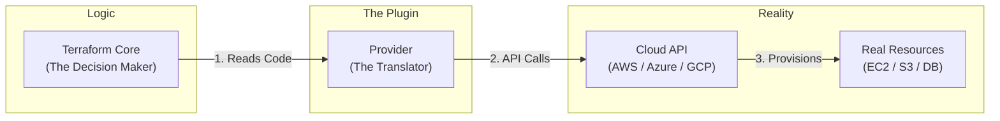
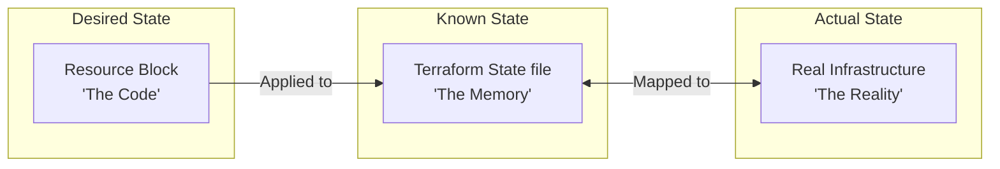
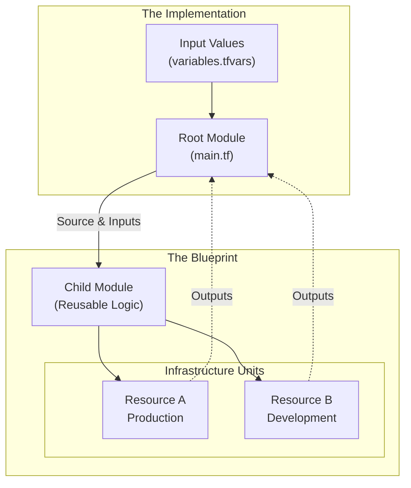
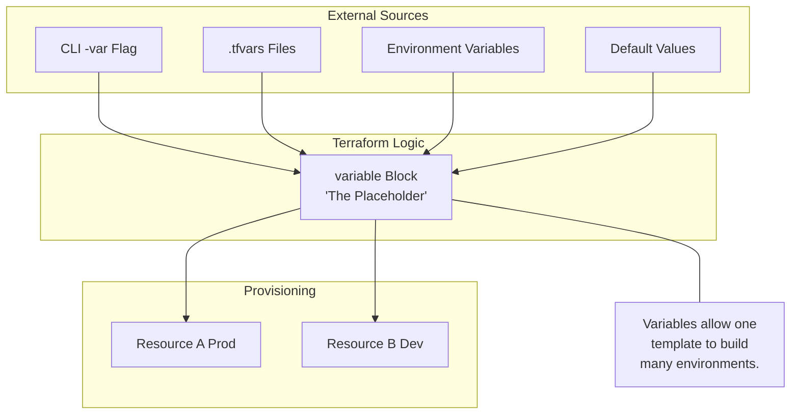
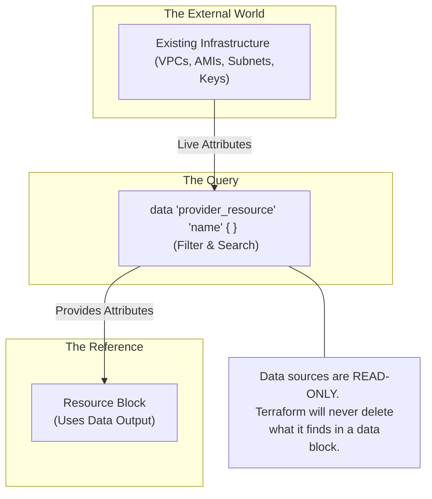
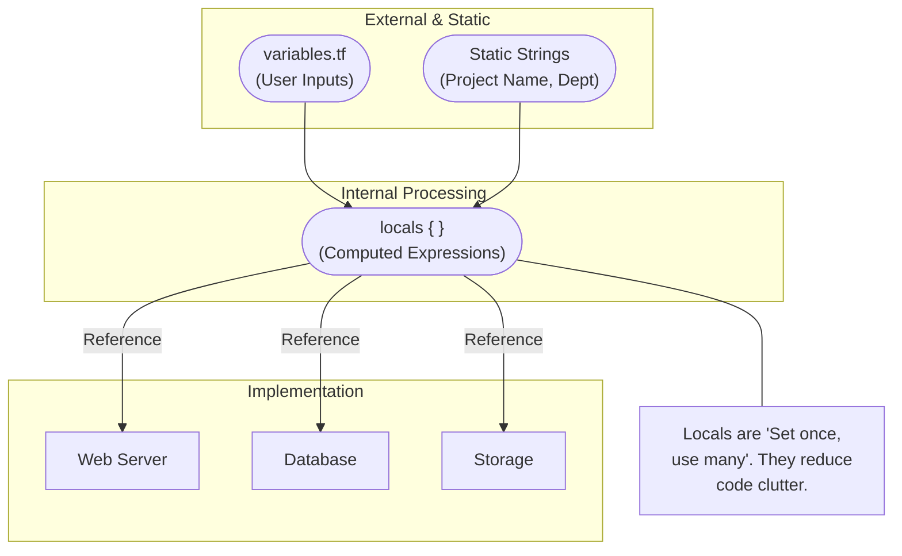
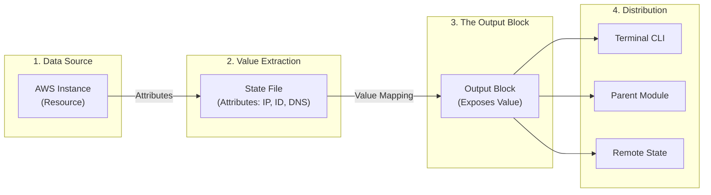
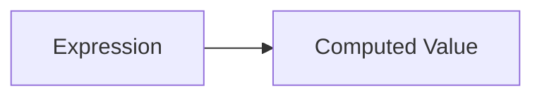

# 02.02-Terraform_Blocks.md

Terraform is block-based.
Each block represents a specific **responsibility** in Terraform.

> *`terraform` defines rules*

> *`provider` connects APIs* 

> *`resource` creates infrastructure, and other blocks support configuration, reuse, and outputs.*

## 1.1 General Block Structure

```hcl
block_type "label" "name" {
  argument = value
}
```

**Explanation:**

* `block_type` → What kind of block this is
* `label` → Category or resource type (provider-defined)
* `name` → Logical name used internally by Terraform
* `argument` → Configuration inputs

---

## 1.2 Types of Terraform Blocks

Terraform supports the following **core block types**:

| Block Type  | Purpose                      |
| ----------- | ---------------------------- |
| `terraform` | Configure Terraform itself   |
| `provider`  | Define platform/API          |
| `resource`  | Create infrastructure        |
| `data`      | Read existing infrastructure |
| `variable`  | Declare input variables      |
| `output`    | Export values                |
| `locals`    | Define local expressions     |
| `module`    | Reuse Terraform code         |

---

## 1.3 High-Level Block Relationship



---
##  2. Global Settings
It covers 

* The `terraform` Block
* The `provider` Block

## 2.1 The `terraform` Block

### 2.1.1 Definition
The `terraform` block configures **Terraform’s own behavior**.

> **Think of it as** : *“Terraform, these are your rules before you start. This block **never creates infrastructure**.”*

---

### 2.1.2 Functions

Used to define:

* Required Terraform version
* Required providers
* Backend (state storage)

---

### 2.1.3 Terraform Code Example

```hcl
terraform {
  required_version = ">= 1.6.0"

  required_providers {
    aws = {
      source  = "hashicorp/aws"
      version = "~> 5.0"
    }
  }

  backend "s3" {
    bucket = "tf-state-bucket"
    key    = "prod/terraform.tfstate"
    region = "ap-south-1"
  }
}
```

---

### 2.1.4 Mermaid Diagram


---

## 2.2. The `provider` Block

### 2.2.1 Definition

The `provider` block tells Terraform **which platform to talk to**.

> **Think of it as** : *the **bridge** between Terraform and real-world systems. Without a provider, Terraform **cannot create or read resources**.”*

Examples:

* AWS
* Azure
* GCP
* Kubernetes

---

### 2.2.2 Function

* Authenticates to APIs
* Translates Terraform requests into API calls
* Manages lifecycle of resources

---

### 2.2.3 Terraform Code Example

```hcl
provider "aws" {
  region = "ap-south-1"
}
```

---

### 2.2.4 Mermaid Diagram


---
##  3. Global Settings
It covers 

* The `resource` Block
* The `module` Block

## 3.1. The `resource` Block

### 3.1.1 Definition

The `resource` block defines **actual infrastructure**. This is where **things get created**.

> **Think of it as** : 
> * `resource_type` → Defined by provider.
> * `resource_name` → Local Terraform reference.
---

### 3.1.2 Function

* Creates
* Updates
* Deletes
  real-world resources

Examples:

* EC2 instances
* VPCs
* Buckets
* Load balancers

---

### 3.1.3 Terraform Code Example

```hcl
resource "aws_instance" "web" {
  ami           = "ami-0abcd1234"
  instance_type = "t2.micro"
}
```

---

### 3.1.4 Mermaid Diagram


## 3.2 The `module` Block

The `module` block is used to **reuse Terraform code**.

### 3.2.1 Function

* Groups related resources into a single unit
* Promotes reusability and consistency
* Helps manage large infrastructure cleanly

**Key idea:**

> A module is a **container for multiple resources**.
Used for **reusability**.

```hcl
module "vpc" {
  source = "./modules/vpc"
}
```



---
## 4. Input & Logic
It covers 

* The `variable` Block
* The `locals` Block
* The `data` Block

---

### 4.1 The `variable` Block

The `variable` block is used to **define input parameters** for Terraform configurations.

> Variables do **not create infrastructure** — they provide values used by resources.

**Functions:**

* Allows customization without changing code
* Makes configurations reusable across environments
* Accepts values from CLI, `.tfvars`, or environment variables
* Supports type validation and default values

Variables act as **inputs** to Terraform and can be overridden at runtime.

```hcl
variable "instance_type" {
  type    = string
  default = "t2.micro"
}
```



---

### 4.2 The `data` Block

The `data` block is used to **read information from existing infrastructure** without creating or modifying resources.

> The `data` block **never creates infrastructure** — it only **reads and exposes values**

**Functions:**

* Fetches attributes of already-existing resources
* Allows Terraform to reference external or pre-created infrastructure
* Helps integrate Terraform with manually created or shared resources
* Ensures read-only access (no lifecycle actions)

Data sources are **provider-dependent** and are evaluated during `plan` and `apply`.

```python
data "aws_ami" "latest" {
  most_recent = true
}
```



---

### 4.3 `locals` Block

The `locals` block is used to define **reusable expressions and computed values** within a Terraform configuration.
> `locals` do **not create resources** — they simply help organize and simplify configuration logic.

**Functions:**

* Reduces repetition in Terraform code
* Improves readability and maintainability
* Stores calculated or derived values
* Acts like constants within a module

Local values are **evaluated at runtime** and **cannot be overridden** like variables.

```python
locals {
  env = "prod"
}
```




---
## 5. Outputs

### 5.1 `output` Block

The `output` block is used to **export values from Terraform after `apply`**.
> Outputs do **not create infrastructure** — they only **expose values**.

**Functions:**

* Displays important information after infrastructure creation
* Exposes values for use by other modules
* Helps users easily access resource attributes
* Enables sharing data between root and child modules

**Common use cases:**

* Public IPs of servers
* Load balancer DNS names
* Resource IDs
* Passing values to parent modules or remote state consumers

```python
output "s3_bucket_arn" {
  description = "The ARN of the newly created bucket"
  value       = aws_s3_bucket.my_bucket.arn
}
```


---

## 6. Syntax Basics

### 6.1 Blocks

```python
resource "aws_instance" "web" {
  ami           = "ami-0abcd1234"
  instance_type = "t2.micro"
  tags = {
    Name = "web-server"
  }
}
```

Blocks:

* `{ }` encloses the block
* Group related configuration
* All related configuration for **one resource** is grouped together
* Arguments inside the block belong **only to this resource**

---

### 6.2 Arguments

Arguments are **key–value pairs** defined **inside Terraform blocks**.
They provide the **actual configuration details** for a block.


> Arguments **do not stand alone** — they only exist **inside blocks** and control how Terraform behaves.

**Example structure:**

```hcl
argument_name = value
```

**Rules:**

* One argument per line
* Equals (`=`) sign is mandatory
* Argument names are defined by the block type or provider
* Values can be strings, numbers, booleans, lists, or maps

**Example in context:**

```hcl
resource "aws_instance" "web" {
  ami           = "ami-0abcd1234"
  instance_type = "t2.micro"
}
```

### 6.3 Expressions

Expressions are used to **compute values dynamically** in Terraform.
Instead of hardcoding values, Terraform evaluates expressions at runtime.

**What expressions do:**

* Reference values from variables, resources, or data sources
* Combine or transform values
* Call built-in functions
* Enable dynamic and conditional configuration

**Conceptual idea:**

> The value comes from **somewhere else**, not typed directly. 

> Expressions **do not create infrastructure** — they compute values that Terraform uses while planning and applying resources.




---

### Types of Expressions in Terraform

Terraform supports multiple kinds of expressions:

#### **1. Literal Expressions**

Hardcoded values.

```hcl
"prod"
10
true
```

---

#### **2. Variable References**

Reference input variables.

```hcl
var.instance_type
```

---

#### **3. Resource Attribute References**

Access attributes of resources.

```hcl
aws_instance.web.public_ip
```

---

#### **4. Data Source References**

Read values from existing infrastructure.

```hcl
data.aws_ami.latest.id
```

---

#### **5. Local Value References**

Use values defined in `locals`.

```hcl
local.env
```

---

#### **6. Function Calls**

Use built-in Terraform functions.

```hcl
length(var.subnets)
upper(var.env)
```

---

#### **7. Conditional Expressions**

Return values based on conditions.

```hcl
var.env == "prod" ? "t3.medium" : "t2.micro"
```

---

#### **8. Collection Expressions**

Work with lists, maps, and sets.

```hcl
var.subnet_ids[0]
var.tags["Name"]
```

---

#### **9. For Expressions**

Transform collections.

```hcl
[for s in var.subnets : s.id]
```

---

#### **10. Splat Expressions**

Access attributes from multiple resources.

```hcl
aws_instance.web[*].id
```
---

## 7. Comments and Formatting

### Comments

Terraform supports:

* Single-line comments

```hcl
# This is a comment
```

or

```hcl
// This is also a comment
```

Comments help humans, not Terraform.

---

### Formatting

Terraform encourages consistent formatting.

Best practices:

* Use two spaces for indentation
* One argument per line
* Align equals signs (optional)

Terraform provides automatic formatting using tooling (covered later).

---

## 8. File Naming Conventions

Terraform does not enforce file names, but conventions matter.

Common conventions:

* `main.tf` – primary resources
* `providers.tf` – provider configuration
* `variables.tf` – input variables
* `outputs.tf` – output values

Why conventions matter:

* Readability
* Team collaboration
* Production readiness
---
