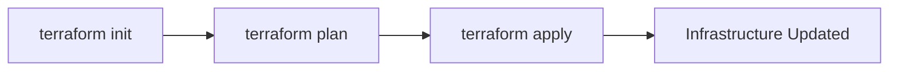
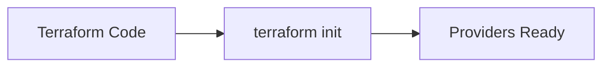
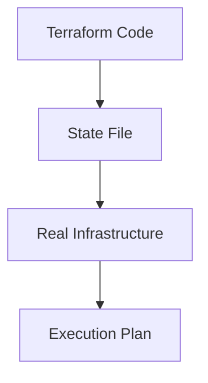
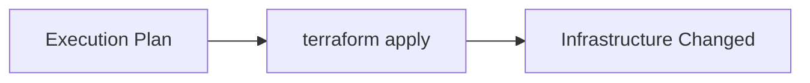
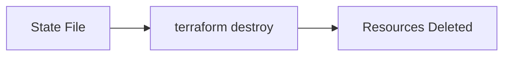
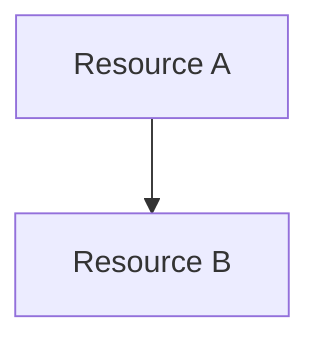

# 02.02 – Terraform Workflow

## 1. Terraform Workflow Overview

Terraform follows a fixed and repeatable workflow:

1. Initialize the project
2. Create an execution plan
3. Apply the changes
4. Destroy resources when required

These steps ensure:

* Safety
* Predictability
* Controlled changes

---

## 2. `terraform init`

`terraform init` prepares the working directory.

What happens internally:

* Downloads required providers
* Initializes backend (state storage)
* Prepares modules (if any)

Important characteristics:

* Safe to run multiple times
* Does not create infrastructure
* Mandatory before any other command

Mental model:

> "Setting up Terraform’s workspace"

---

## 3. Execution Plan Deep Dive (`terraform plan`)

`terraform plan` shows **what Terraform intends to do**.

Terraform compares:

* Desired configuration (code)
* Current state (state file)
* Real infrastructure

Based on comparison, Terraform decides:

* What to create
* What to update
* What to delete

Why the plan is critical:

* No changes are made
* Prevents surprises
* Enables review before apply

---

## 4. `terraform apply`

`terraform apply` executes the plan.

What happens:

* Terraform re-validates the plan
* API calls are made via providers
* State file is updated

Key ideas:

* Apply changes infrastructure
* Only planned actions are executed

---

## 5. Apply vs Destroy

### `terraform apply`

* Creates or updates infrastructure
* Moves infrastructure toward desired state

### `terraform destroy`

* Deletes managed infrastructure
* Uses state file to identify resources

Important distinction:

* Destroy is also a planned action
* Terraform still shows what will be removed

---

## 6. Idempotency Concept

Idempotency means:

> Running the same command multiple times gives the same result.

In Terraform:

* If infrastructure matches the configuration
* `terraform apply` does nothing

Why idempotency matters:

* Safe re-runs
* Reliable automation
* Predictable infrastructure

---

## 7. Dependency Graph (Implicit & Explicit)

Terraform automatically understands dependencies.

### Implicit Dependency

Created when one resource references another.

Terraform detects order automatically.

### Explicit Dependency

Used when dependency is not obvious.

Declared using `depends_on`.

Terraform builds a dependency graph before applying changes.

Why this matters:

* Correct creation order
* Safe deletion order
* Parallel execution when possible

---

## Phase Outcome

After completing this phase, you should:

* Understand Terraform’s internal execution flow
* Know exactly what each Terraform command does
* Trust Terraform’s planning and execution model
* Predict infrastructure changes before they happen

---

## Practice Challenges – Phase 4

1. Explain Terraform workflow without using command names.
2. Why is `terraform init` mandatory before plan or apply?
3. Explain how Terraform decides what to create or update.
4. What does idempotency mean in real-world terms?
5. Draw a diagram showing how Terraform handles dependencies.

---

