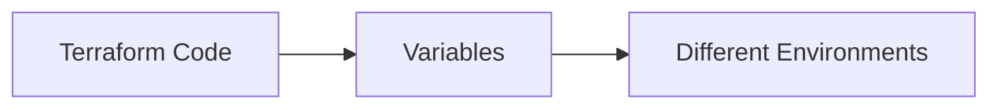
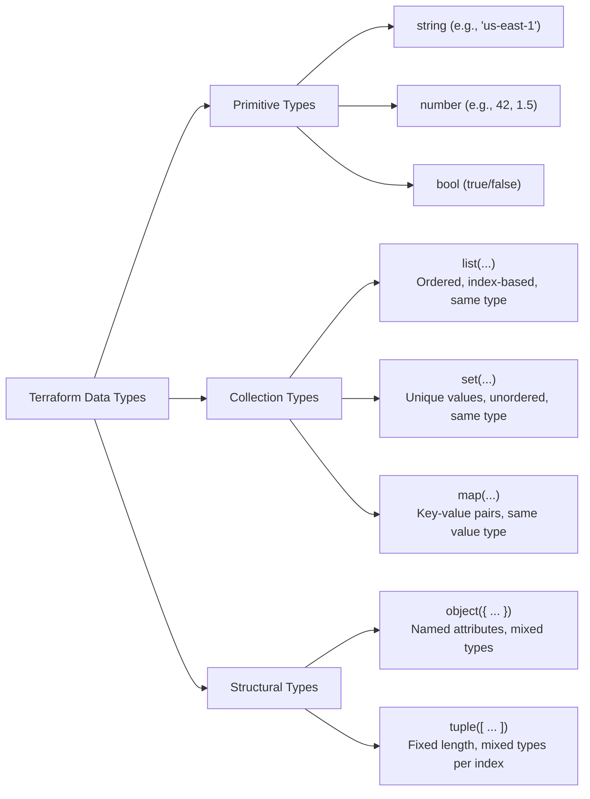
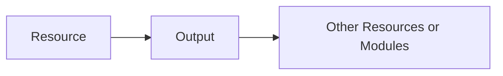

## 02.03 – Variables & Outputs

## 1. Why Variables Are Needed

Without variables:

* Values are hardcoded
* Same code cannot be reused
* Environment-specific changes require file edits

With variables:

* Code becomes reusable
* Same configuration works for dev, test, and prod
* Changes are safer and controlled

Mental model:

> Variables separate **configuration** from **logic**.



---

## 2. Input Variables

Input variables allow users to pass values into Terraform configurations.

They are defined using the `variable` block.

### `variable` Block

Structure:

```hcl
variable "variable_name" {
  description = "Purpose of variable"
  type        = string
  default     = "value"
}
```

Key points:

* Variable name is referenced throughout the code
* Description improves readability
* Default value makes variable optional

---

### Default Values

Default values:

* Make variables optional
* Are used when no value is provided externally

If a variable has no default:

* Terraform requires a value at runtime

---

## 3. Variable Types

Terraform has a small but strict type system.



## 1. Primitive types

* `string` → `"hello"`
* `number` → `42`
* `bool` → `true / false`

## 2. Collection types

### 2.1 List

Ordered sequence (index-based)

```hcl
[ "a", "b", "c" ]
```

* Access: `list[0]`
* Allows duplicates


### 2.2 Set

Unordered, unique values

```hcl
toset(["a", "b", "c"])
```

* No duplicates
* No guaranteed order
* Cannot access by index reliably


### 2.3 Map

Key-value pairs

```hcl
{
  name = "abc"
  env  = "dev"
}
```

* Access: `map["name"]`

---

## 3. Structural types

### 3.1 Object

Fixed structure with named attributes

```hcl
{
  protocol = "lambda"
  endpoint = "arn:..."
}
```

Type definition:

```hcl
object({
  protocol = string
  endpoint = string
})
```


### 3.2 Tuple

Like list, but fixed types per index (rarely used)


## 4. Variable Precedence Order

Terraform follows a strict order when resolving variable values.

Highest priority first:

1. CLI variables (`-var` or `-var-file`)

2. `.tfvars` files

3. Default values in `variable` blocks


## 5. Output Values

Outputs expose values from Terraform after execution.

Used for:

* Displaying important information
* Sharing values between modules
* Debugging

Structure:

```hcl
output "output_name" {
  description = "Purpose of output"
  value       = expression
}
```

Outputs are read-only values.

---

## 6. Using Outputs Across Resources

Outputs allow one part of Terraform to reference another.

Examples:

* Displaying a resource ID
* Passing values to child modules

Conceptual flow:



Outputs help connect infrastructure components cleanly.
   * Tags
   * Ports
   * Feature toggle
4. Explain variable precedence in your own words.
5. Draw a flow showing how outputs connect resources.


## Data type issues

> `for_each cannot iterate over set(object)`


## Why this happens

Terraform's `for_each` only supports:

* ✅ `map(...)`
* ✅ `set(string)`

But you gave:

```hcl
set(object({
  protocol = string
  endpoint = string
}))
```

---

## Why Terraform restricts this

Because `for_each` needs a **stable, unique key** for each instance.


### Works: `set(string)`

```hcl
toset(["a", "b"])
```

Terraform uses the string itself as the key:

```
"a" → instance 1
"b" → instance 2
```

---

### Fails: `set(object)`

```hcl
toset([
  { protocol = "lambda", endpoint = "arn1" },
  { protocol = "lambda", endpoint = "arn2" }
])
```

 Problem:

* Objects don’t have a **natural unique key**
* Terraform cannot safely track resources in state
* Ordering is undefined (because it's a set)

---

##  Key insight

> `for_each` needs **predictable identity**, not just values

---

#  Correct solution

Convert your collection into a **map with unique keys**

---

##  Fix

```hcl
for_each = {
  for sub in var.subscribers : sub.endpoint => sub
}
```

Now Terraform sees:

```hcl
{
  "arn1" = { protocol = "lambda", endpoint = "arn1" }
  "arn2" = { protocol = "lambda", endpoint = "arn2" }
}
```

> Each instance has a stable key (`endpoint`)

---

##  Summary table

| Type           | Works with `for_each` | Why                     |
| -------------- | --------------------- | ----------------------- |
| `set(string)`  | ✅ Yes                 | String = unique key     |
| `map(object)`  | ✅ Yes                 | Keys explicitly defined |
| `list(object)` | ❌ No                  | No stable key           |
| `set(object)`  | ❌ No                  | No identity / unordered |

---

##  Your exact problem in one line

You changed from:

```hcl
set(string) ✅
```

to:

```hcl
set(object) ❌
```

But didn’t give Terraform a way to uniquely identify each object.

---

## Simple analogy

Think of `for_each` like a dictionary:

* ✅ `"user1" → data`
* ❌ `{name="abc"}` → “who is this?”

---

## Best practice going forward

Use:

```hcl
list(object(...))
```

* convert to:

```hcl
map(...) via for expression
```
