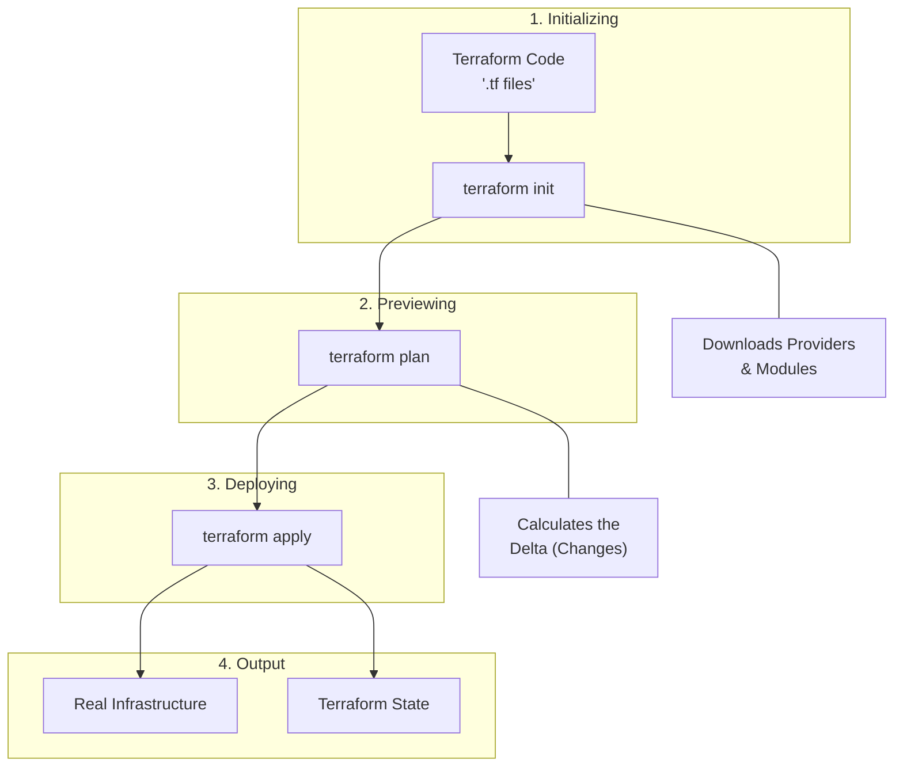
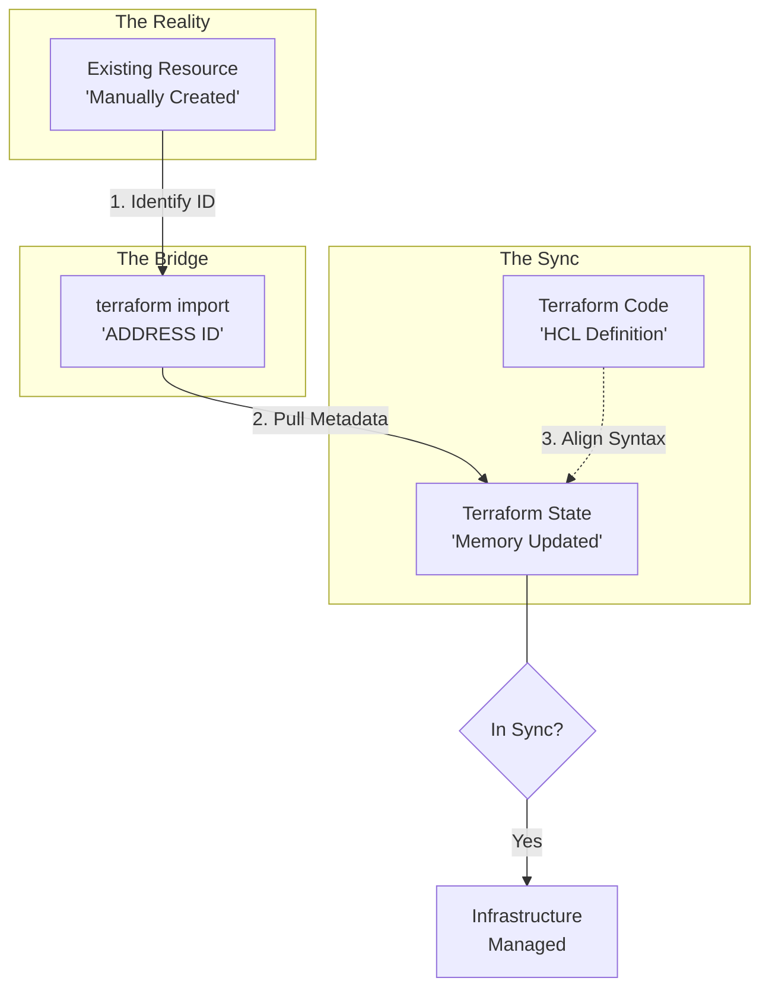
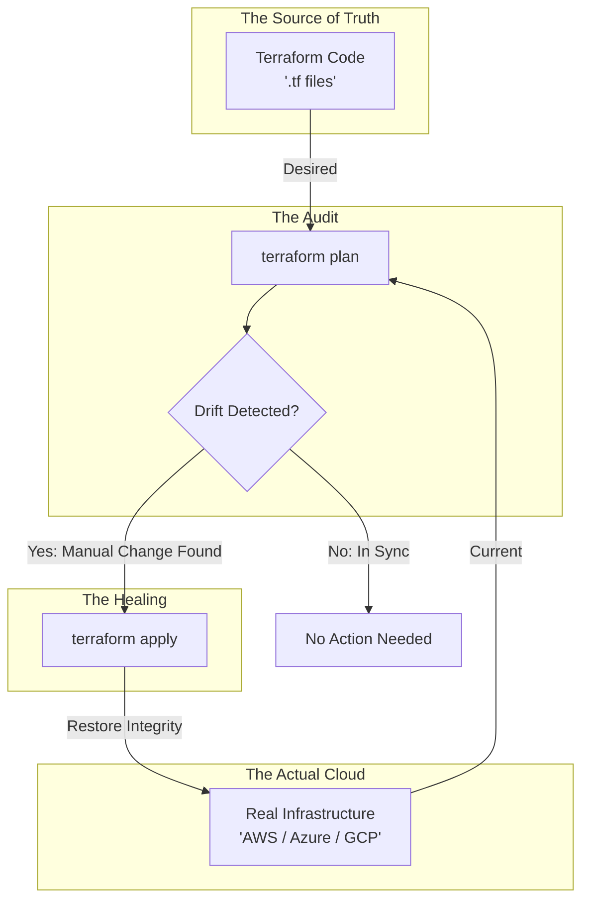
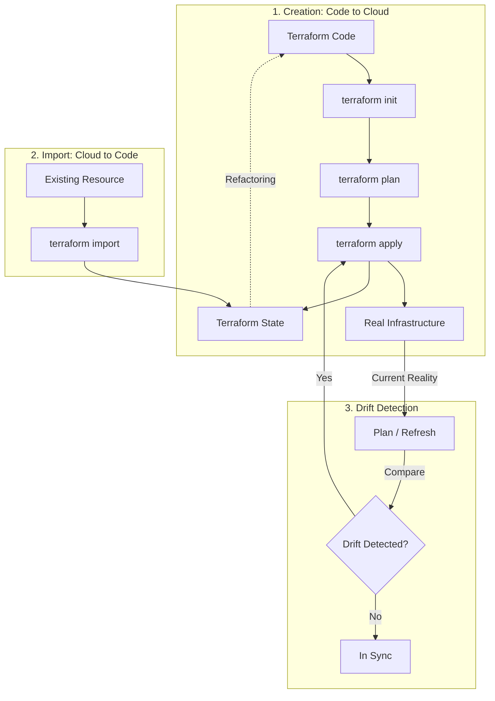
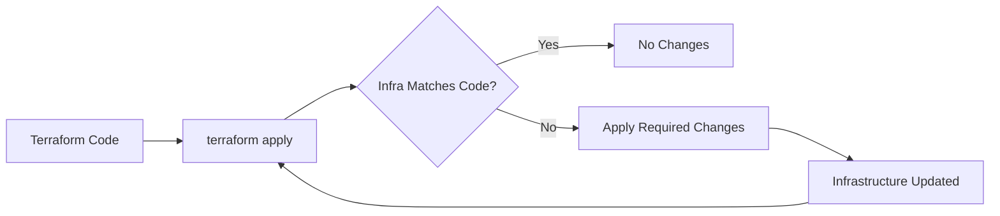
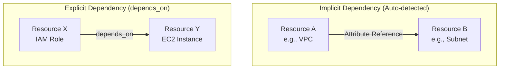

## 02.04 Terraform Workflow Overview

Terraform manages infrastructure through **three major workflows**:

1. **Code → Infrastructure creation**
2. **Infrastructure → Code**
3. **Code Drift detection & correction**

These steps ensure:

* Safety
* Predictability
* Controlled changes
---

## 1️. Code → Infrastructure Creation

This is the **standard Terraform workflow** where infrastructure is created from code.

**Flow:**

* Write Terraform code (`.tf`)
* Initialize providers and backend
* Generate execution plan
* Apply changes to create infrastructure
* Store results in state file

**Key commands:**


* terraform init
* terraform plan
* terraform apply
* terraform destroy


### Mermaid Diagram – Code to Infra



> Terraform compares **desired state (code)** with **current state (state file)** before making changes.

---

## 2. Infrastructure → Code Creation (Import)

This workflow is used when infrastructure **already exists** but is **not managed by Terraform**.

**Why this is needed:**

* Manual infrastructure
* Legacy environments
* Resources created outside Terraform

**Flow:**

* Write empty resource block
* Import existing resource into state
* Terraform updates the state
* User aligns code with imported state

**Key command:**

```bash
terraform import
```

### Mermaid Diagram – Infra to Code (Import)



> `terraform import` **does not generate code** — it only updates the **state file**.

---

## 3. Code Drift (Drift Detection & Correction)

**Code drift** occurs when infrastructure is modified **outside Terraform**.

**Examples:**

* Manual changes in cloud console
* Scripts altering resources
* Auto-scaling or policy updates

**Flow:**

* Terraform compares code vs real infra
* Drift is detected during `plan`
* Terraform proposes corrective actions

**Key command:**

```bash
terraform plan
```

### Code Drift Workflow


> Terraform always trusts **code as the source of truth**.

---

## Overall Three Terraform Workflow (Combined)

### Mermaid Diagram – Complete Terraform Lifecycle



---


## 6. Idempotency Concept

Idempotency means:

> Running the same command multiple times gives the same result.

In Terraform:

* If infrastructure matches the configuration
* `terraform apply` does nothing

Why idempotency matters:

* Safe re-runs
* Reliable automation
* Predictable infrastructure



---

## 7. Dependency Graph (Implicit & Explicit)

Terraform automatically understands dependencies.

### Implicit Dependency

* Created when one resource references another.

* Terraform detects order automatically.

### Explicit Dependency

* Used when dependency is not obvious.

* Declared using `depends_on`.



Terraform builds a dependency graph before applying changes.

Why this matters:

* Correct creation order
* Safe deletion order
* Parallel execution when possible

---

