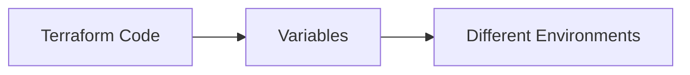
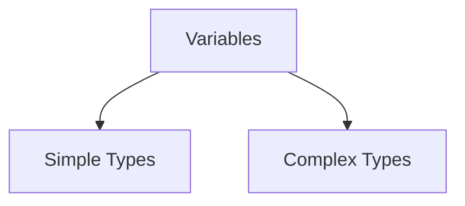
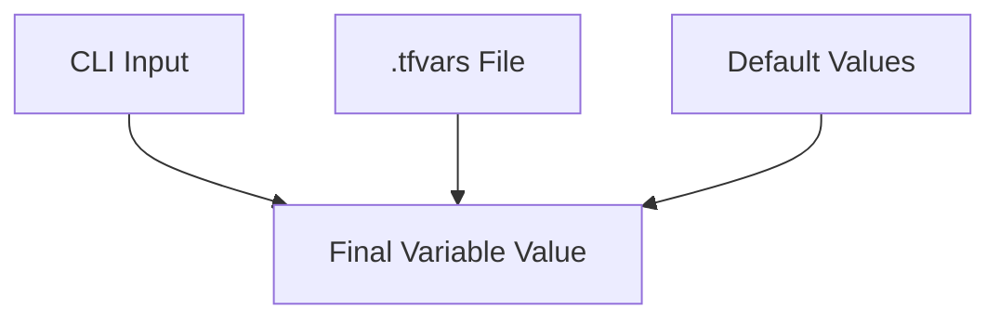

## PHASE 5 – Variables & Outputs

## 1. Why Variables Are Needed

Without variables:

* Values are hardcoded
* Same code cannot be reused
* Environment-specific changes require file edits

With variables:

* Code becomes reusable
* Same configuration works for dev, test, and prod
* Changes are safer and controlled

Mental model:

> Variables separate **configuration** from **logic**.



---

## 2. Input Variables

Input variables allow users to pass values into Terraform configurations.

They are defined using the `variable` block.

### `variable` Block

Structure:

```hcl
variable "variable_name" {
  description = "Purpose of variable"
  type        = string
  default     = "value"
}
```

Key points:

* Variable name is referenced throughout the code
* Description improves readability
* Default value makes variable optional

---

### Default Values

Default values:

* Make variables optional
* Are used when no value is provided externally

If a variable has no default:

* Terraform requires a value at runtime

---

## 3. Variable Types

Terraform supports strong typing to prevent mistakes.

---

### 3.1 `string`

Represents text values.

Example use cases:

* Resource names
* Regions
* Instance types

---

### 3.2 `number`

Represents numeric values.

Example use cases:

* Port numbers
* Counts
* Sizes

---

### 3.3 `bool`

Represents true or false.

Example use cases:

* Enable or disable features
* Conditional behavior

---

### 3.4 `list`

Represents an ordered collection of values.

Example use cases:

* Multiple CIDR blocks
* Availability zones

---

### 3.5 `map`

Represents key-value pairs.

Example use cases:

* Tags
* Configuration mappings

---

### 3.6 `object`

Represents complex structured data.

Example use cases:

* Grouping related configuration
* Complex resource definitions



---

## 4. Variable Precedence Order

Terraform follows a strict order when resolving variable values.

Highest priority first:

1. CLI variables (`-var` or `-var-file`)
2. `.tfvars` files
3. Default values in `variable` blocks

Mental model:

> Closest input overrides distant defaults.



---

## 5. Output Values

Outputs expose values from Terraform after execution.

Used for:

* Displaying important information
* Sharing values between modules
* Debugging

Structure:

```hcl
output "output_name" {
  description = "Purpose of output"
  value       = expression
}
```

Outputs are read-only values.

---

## 6. Using Outputs Across Resources

Outputs allow one part of Terraform to reference another.

Examples:

* Displaying a resource ID
* Passing values to child modules

Conceptual flow:


Outputs help connect infrastructure components cleanly.

---

## Phase Outcome

After completing this phase, you should be able to:

* Replace hardcoded values with variables
* Choose correct variable types
* Understand how Terraform resolves variable values
* Use outputs to expose and reuse information

Your Terraform code is now reusable and scalable.

---

## Practice Challenges – Phase 5

1. Explain why hardcoding values is risky in Terraform.
2. Describe a real scenario where variables improve reusability.
3. Identify which variable type fits each use case:

   * Tags
   * Ports
   * Feature toggle
4. Explain variable precedence in your own words.
5. Draw a flow showing how outputs connect resources.
