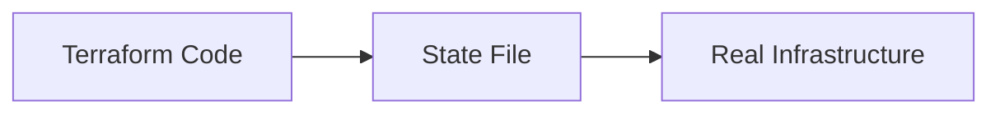
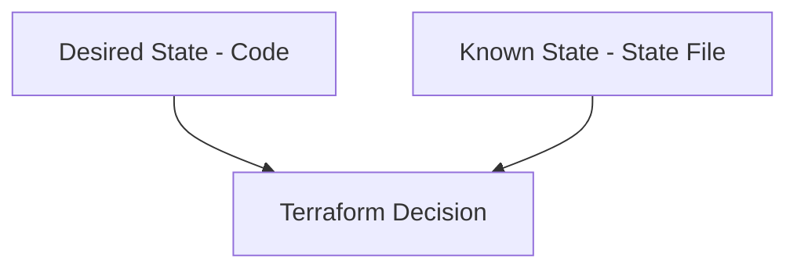
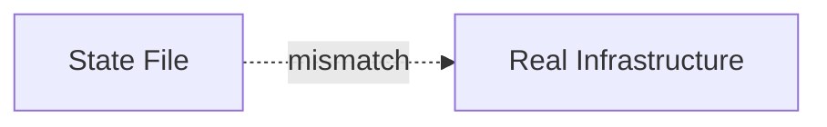
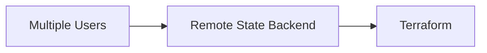
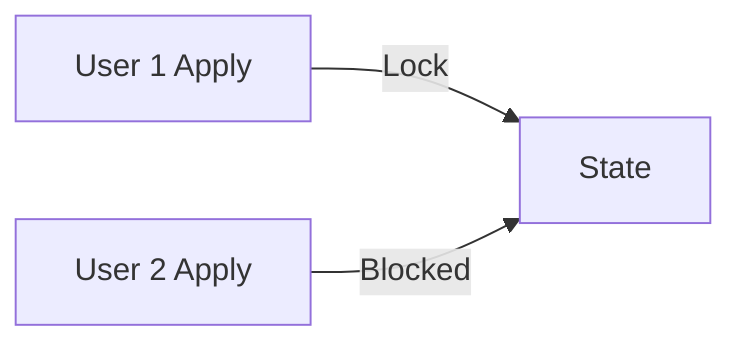

## 03.01 – Terraform State

## 1. What is Terraform State?

Terraform State is Terraform’s **source of truth** about infrastructure.

It is a data record that maps:

* Terraform resources (code)
* To real-world infrastructure objects

In simple terms:

> State is Terraform’s memory.

Terraform does not scan the cloud every time. Instead, it relies on the state file to know what it manages.



---

## 2. Why State Is Needed

Without state, Terraform cannot function correctly.

State is required to:

* Know what resources already exist
* Detect changes (drift)
* Decide whether to create, update, or delete
* Avoid duplicating resources

Mental model:

> Terraform compares **Desired State (code)** with **Known State (state file)**.



---

## 3. `terraform.tfstate` File

The state file is usually named:

```text
terraform.tfstate
```

This file contains:

* Resource IDs
* Attributes returned by providers
* Dependency information
* Metadata for updates and deletes

Important characteristics:

* Machine-readable (JSON format)
* Not meant to be edited manually
* Automatically updated by Terraform

Terraform also keeps:

* `terraform.tfstate.backup` for safety

---

## 4. State vs Real Infrastructure

Terraform does NOT continuously monitor real infrastructure.

Instead:

* State represents what Terraform *believes* exists
* Real infrastructure may change outside Terraform

This difference leads to **drift**.

Example drift scenarios:

* Resource deleted manually in cloud console
* Resource modified outside Terraform



Terraform detects drift during planning.

---

## 5. Local State vs Remote State

### Local State

Characteristics:

* Stored on local machine
* Default behavior
* Simple setup

Limitations:

* Not safe for teams
* Risk of loss
* No locking by default

---

### Remote State

Characteristics:

* Stored in remote backend
* Shared across team
* Supports locking

Benefits:

* Team collaboration
* Centralized state
* Better reliability



Remote state is mandatory for production environments.

---

## 6. State Locking Concept

State locking prevents **concurrent modifications**.

Problem without locking:

* Two users apply changes at same time
* State corruption
* Infrastructure inconsistency

With locking:

* Only one Terraform operation at a time



Locking is supported by most remote backends.

---

## 7. State Security Concerns

State files may contain:

* Resource IDs
* IP addresses
* Sensitive outputs

Risks:

* Unauthorized access
* Exposure of sensitive data

Best practices:

* Never commit state to Git
* Use remote backends
* Restrict access
* Encrypt state at rest

Mental model:

> Treat state like credentials.

---

## Phase Outcome

After completing this phase, you should:

* Clearly understand what Terraform State is
* Know why Terraform depends on state
* Understand differences between local and remote state
* Recognize state-related risks

You now understand **Terraform’s brain**.

---

## Practice Challenges – Phase 6

1. Explain Terraform State without using the word “file”.
2. Why can Terraform not work without state?
3. Describe a real scenario where state drift can occur.
4. Explain why local state is risky for teams.
5. Draw a diagram showing how state locking prevents conflicts.
