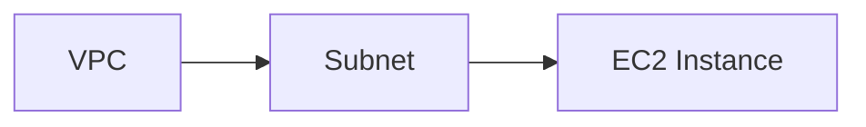
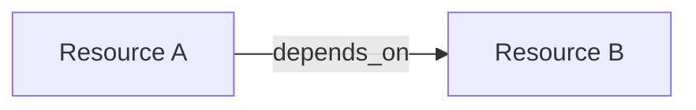
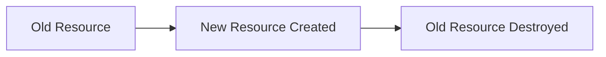
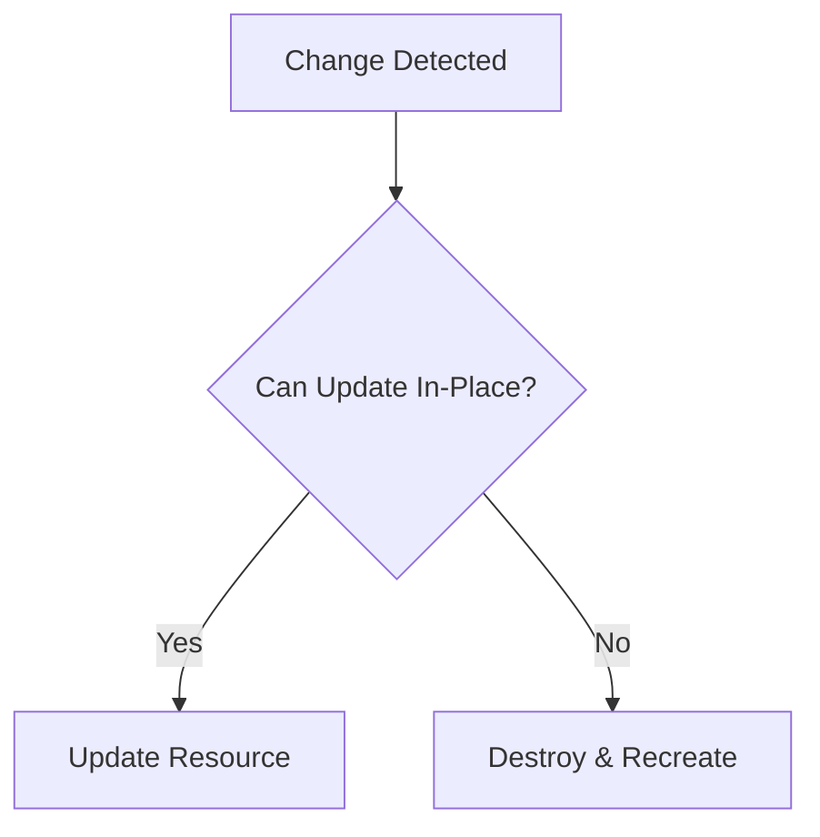
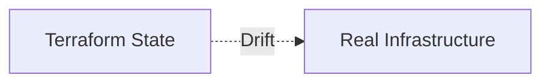

## 03.02 – Resource Behavior & Lifecycle

## 1. Resource Dependencies

Terraform builds a **dependency graph** to decide the order of resource creation.

Dependencies can be:

* **Implicit** (auto-detected)
* **Explicit** (manually defined)

Example of implicit dependency:

* An EC2 instance using a subnet ID
* Terraform understands subnet must exist first

Terraform automatically handles this ordering.

---

## 2. `depends_on`

`depends_on` is used when Terraform **cannot detect dependencies automatically**.

Use cases:

* External systems
* Indirect relationships
* Non-referenced resources

Example concept:

* Resource B must wait for Resource A

Key rule:

> Use `depends_on` only when necessary. Overuse makes plans harder to manage.

---

## 3. Lifecycle Rules

Lifecycle rules allow you to **control destructive behavior**.

Lifecycle configuration is optional but powerful.

---

### a. `create_before_destroy`

Default behavior:

* Terraform destroys old resource
* Then creates new one

With `create_before_destroy`:

* New resource is created first
* Old resource is destroyed later

Used for:

* Zero-downtime updates

---

### b. `prevent_destroy`

Prevents accidental deletion of critical resources.

If destroy is attempted:

* Terraform fails
* No changes applied

Use cases:

* Databases
* Production resources

Mental model:

> Safety lock for infrastructure.

---

### c. `ignore_changes`

Tells Terraform to **ignore specific attribute changes**.

Useful when:

* External systems modify resources
* You want Terraform to stop managing certain fields

Example scenarios:

* Auto-scaling modifying instance count
* Cloud-managed attributes

---

## 4. Resource Replacement vs Update

Terraform decides between:

* **In-place update**
* **Destroy and recreate (replacement)**

Factors affecting behavior:

* Provider capabilities
* Attribute type
* Immutable fields

Visual flow:

Understanding this avoids surprises during `apply`.

---

## 5. Drift Detection

Drift occurs when:

* Real infrastructure changes
* Terraform state is outdated

Terraform detects drift during:

* `terraform plan`
* `terraform apply`

Drift sources:

* Manual console changes
* Automation outside Terraform

Best practice:

> One source of truth – Terraform.

---

## Phase Outcome

After this phase, you can:

* Control creation and deletion order
* Prevent accidental destruction
* Understand replacement vs update behavior
* Handle drift safely

You now know **how Terraform behaves over time**.

---

## Practice Challenges – Phase 7

1. Explain implicit vs explicit dependencies with examples.
2. When should `depends_on` be avoided?
3. Describe a zero-downtime update scenario.
4. Why is `prevent_destroy` dangerous if misused?
5. Explain drift and how Terraform detects it.
