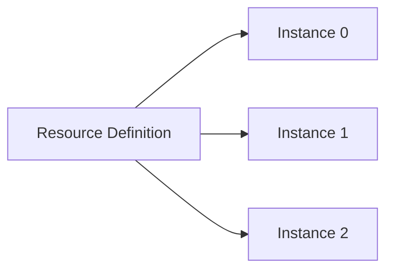
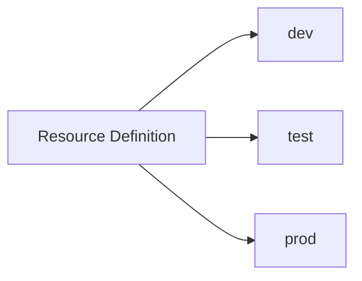
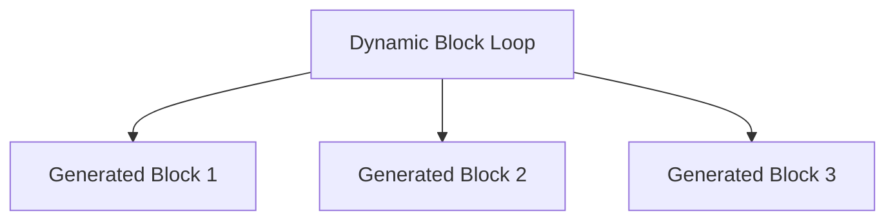
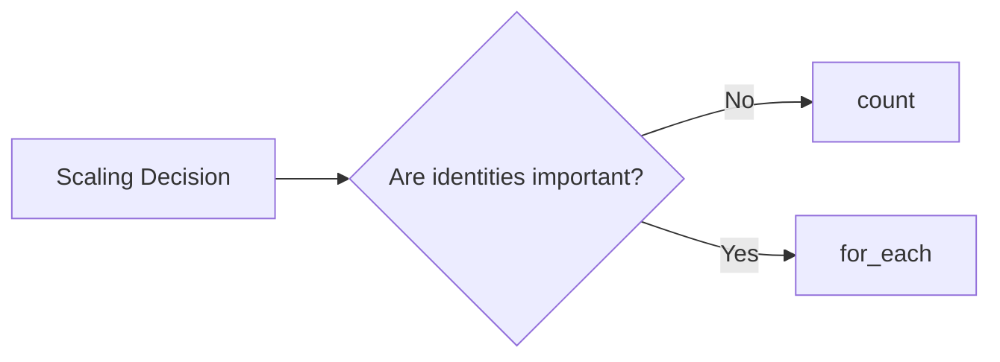

## 03.03 – Meta-Arguments

## 1. `count`

`count` allows Terraform to create **multiple instances of the same resource**.

Mental model:

> "Create this resource N times."

Key points:

* `count` accepts a number
* Resources are indexed starting from `0`

Example concept:

* Create 3 identical servers

Limitations of `count`:

* Index-based access is fragile
* Reordering can cause resource replacement

---

## 2. `for_each`

`for_each` creates resources based on **keys in a map or set**.

Mental model:

> "Create one resource per unique key."

Key points:

* Uses map or set values
* Resources are identified by keys, not numbers

Example concept:

* Create servers for specific environments

Advantages over `count`:

* Stable resource identity
* Safer for long-term infrastructure

---

## 3. Conditional Expressions

Conditional expressions allow **logic-based decisions** in Terraform.

Mental model:

> "If condition is true, use this value; otherwise use that value."

Used for:

* Environment-based configuration
* Optional resources
* Dynamic values

Example scenarios:

* Enable monitoring only in production
* Choose instance size based on environment

---

## 4. Dynamic Blocks

Dynamic blocks generate **nested configuration blocks dynamically**.

Used when:

* Resource supports repeated nested blocks
* Number of blocks is not fixed

Mental model:

> "Loop inside a resource block."

Example use cases:

* Security group rules
* Firewall rules
* Disk attachments

Dynamic blocks improve:

* Readability
* Maintainability
* Scalability

---

## 5. `count` vs `for_each`

### Use `count` when:

* Resources are truly identical
* Order does not matter
* Simple scaling is needed

### Use `for_each` when:

* Resources need unique identity
* Long-term stability is required
* Managing named objects

Comparison summary:

Rule of thumb:

> Prefer `for_each` for production infrastructure.

---

## Phase Outcome

After completing this phase, you can:

* Avoid copy-paste Terraform code
* Scale resources safely
* Use logic and loops in Terraform
* Choose the right meta-argument

Terraform now feels **powerful and expressive**.

---

## Practice Challenges – Phase 8

1. Explain why `count` can be risky in long-lived infrastructure.
2. Describe a scenario where `for_each` is mandatory.
3. Explain conditional expressions in simple terms.
4. Where are dynamic blocks commonly used?
5. Choose between `count` and `for_each` for managing environments.
