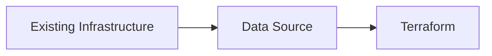
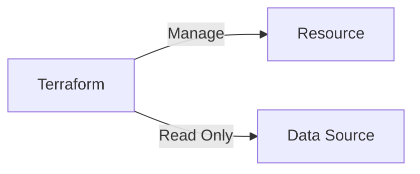
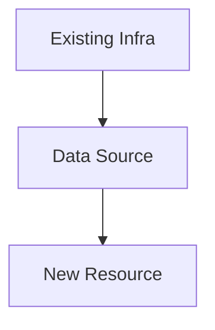
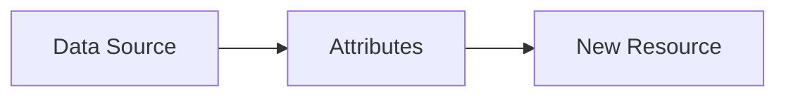

## 03.04 – Data Sources

## 1. What Is a Data Source?

A data source allows Terraform to **fetch read-only information** from providers.

Mental model:

> "Look up something that already exists."

Key characteristics:

* Read-only
* No create, update, or delete actions
* Evaluated during plan/apply

---

## 2. Data Source vs Resource

Understanding this distinction is critical.

### Resource

* Creates infrastructure
* Modifies infrastructure
* Deletes infrastructure
* Stored and managed in state

### Data Source

* Reads existing infrastructure
* No lifecycle control
* Referenced but not managed

Mental comparison:

> Resources manage. Data sources observe.

---

## 3. Fetching Existing Infrastructure

Data sources are commonly used to:

* Read existing VPCs
* Lookup AMIs or images
* Fetch subnets, security groups
* Reference DNS records

Common scenarios:

* Shared infrastructure managed elsewhere
* Brownfield environments
* Multi-team environments

Terraform does not take ownership of fetched resources.

---

## 4. Using Data in Resources

Fetched data can be:

* Passed as input to resources
* Used in expressions
* Combined with variables

Typical flow:

1. Lookup existing component
2. Use its attributes
3. Create dependent resources

This enables safe integration with existing systems.

---

## Phase Outcome

After this phase, you can:

* Read existing infrastructure safely
* Combine managed and unmanaged resources
* Integrate Terraform into real environments

Terraform now works well in **brownfield and enterprise setups**.

---

## Practice Challenges – Phase 9

1. Explain data sources without using the word "read".
2. Why should data sources not be used to manage infrastructure?
3. Describe a real-world use case for data sources.
4. Explain how data sources help in shared environments.
5. Draw a flow showing data source feeding a resource.
