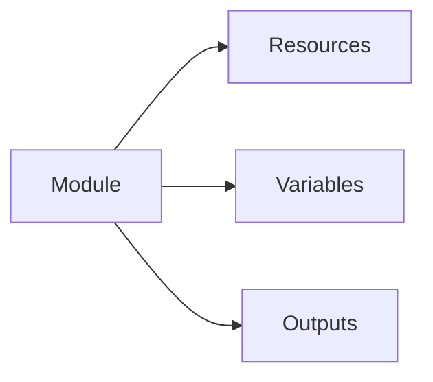
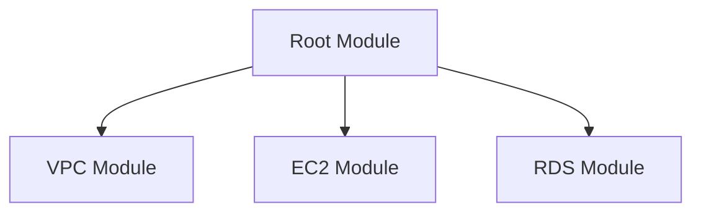
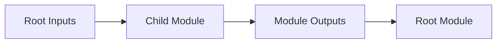
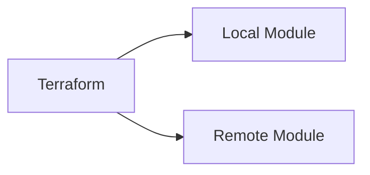

## 04.01 – Modules A Reusable Terraform Code

## 1. What Are Modules?

A module is a **collection of Terraform files** that are used together.

Mental model:

> "A module is a reusable infrastructure blueprint."

Key points:

* Every Terraform project is a module
* Modules help enforce consistency
* Modules reduce copy-paste

---

## 2. Root Module vs Child Module

### Root Module

* The main directory where Terraform is executed
* Contains provider configuration
* Calls child modules

### Child Module

* Reusable module
* Called by root or other modules
* Encapsulates specific functionality

---

## 3. Module Structure

A standard module structure:

* `main.tf` – resource definitions
* `variables.tf` – input variables
* `outputs.tf` – exposed outputs
* `README.md` – documentation

Best practice:

> One module = one responsibility.

---

## 4. Passing Inputs & Outputs

Modules communicate using:

* **Input variables**
* **Output values**

Flow:

1. Root module passes inputs
2. Child module creates resources
3. Child module exposes outputs
4. Root module consumes outputs

This enables clean composition of infrastructure.

---

## 5. Module Versioning

Versioning ensures:

* Stability
* Predictable deployments
* Safe upgrades

Common strategies:

* Git tags
* Semantic versioning

Best practice:

> Always pin module versions in production.

---

## 6. Local Modules vs Remote Modules

### Local Modules

* Stored in same repository
* Easy to develop
* Good for internal projects

### Remote Modules

* Stored in Git repositories or registries
* Versioned
* Shareable across teams

Production environments usually rely on remote modules.

---

## 7. Terraform Registry

The Terraform Registry is a public repository of reusable modules.

Benefits:

* Community-tested modules
* Versioned releases
* Documentation included

Best practices:

* Review module code
* Understand inputs/outputs
* Avoid blindly using modules

Mental model:

> Registry modules are building blocks, not magic.

---

## Phase Outcome

After this phase, you can:

* Design reusable Terraform modules
* Structure production repositories
* Share infrastructure components
* Read and use Terraform Registry modules

You now write **engineering-grade Terraform**.

---

## Practice Challenges

1. Explain modules without using the word "reuse".
2. Why is every Terraform project technically a module?
3. Describe a good module responsibility.
4. Why should module versions be pinned?
5. Explain the difference between local and remote modules.

**Next Phase:** Terraform State Backends & Remote State Management
