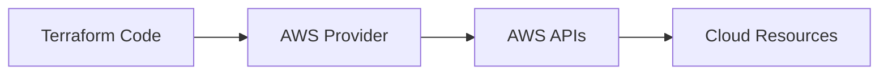
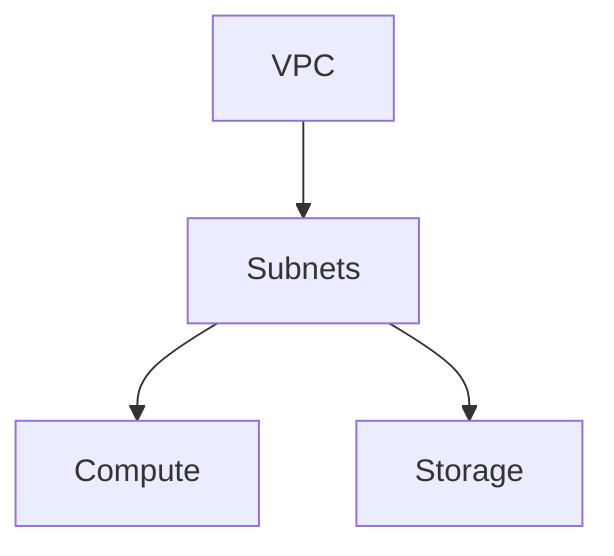
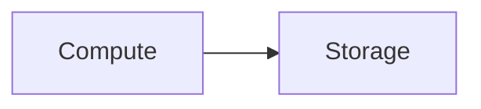

## 05.01 – Terraform with Cloud (Beginner Level)

## 1. Terraform with AWS (Cloud Overview)

Terraform communicates with cloud platforms through **providers**.

In this phase, AWS is used as the reference cloud, but the concepts apply equally to Azure and GCP.

Mental model:

> "Terraform gives instructions, the cloud executes them."

Key points:

* Terraform does not manage cloud accounts
* Terraform uses cloud APIs
* Permissions control what Terraform can do

---

## 2. IAM Basics for Terraform

Terraform requires **permissions** to create and manage resources.

IAM concepts (high-level):

* **User / Role:** Identity Terraform uses
* **Policy:** Permissions granted

Best practice:

> Terraform should use the **minimum permissions required**.

Common beginner approach:

* Separate IAM identity for Terraform
* Avoid using personal admin credentials

Security mindset:

> If Terraform is compromised, permissions limit damage.

---

## 3. Provisioning Core Cloud Resources

This section introduces the **most common cloud building blocks**.

---

### a. VPC (Intro Level)

A VPC is a **private network** in the cloud.

Terraform usage:

* Create isolated networking
* Control IP ranges
* Attach compute and storage

Mental model:

> "VPC is the boundary for everything else."

---

### b. Compute

Compute represents **virtual machines or instances**.

Terraform can:

* Create instances
* Attach networking
* Apply configuration

Beginner focus:

* One instance
* Simple configuration
* No autoscaling yet

---

### c. Storage

Storage represents **persistent data services**.

Common beginner examples:

* Object storage (e.g., S3)
* Block storage (attached to compute)

Terraform manages:

* Creation
* Configuration
* Access policies

---

## 4. Best Practices for Cloud Usage

Beginner-safe best practices:

* Always use a **separate cloud account or project** for learning
* Start with **small resource sizes**
* Destroy resources after practice
* Never hardcode credentials
* Review plans before apply

Operational mindset:

> Terraform is powerful. Treat every apply seriously.

---

## Phase Outcome

After this phase, you can:

* Connect Terraform to a real cloud
* Understand IAM needs for Terraform
* Provision basic networking, compute, and storage
* Follow safe cloud practices

You can now deploy **real infrastructure using Terraform**.

---

## Practice Challenges – Phase 12

1. Explain how Terraform talks to the cloud.
2. Why should Terraform have limited IAM permissions?
3. Describe the role of a VPC in simple terms.
4. Why is it important to destroy learning resources?
5. Draw a flow from Terraform code to cloud resources.
