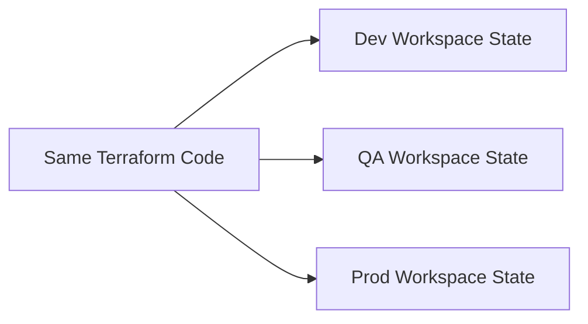
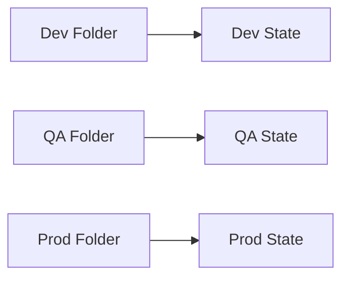
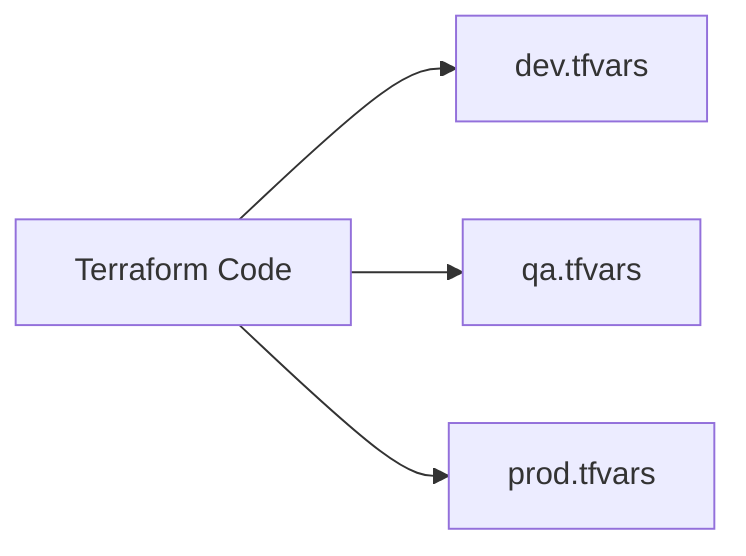
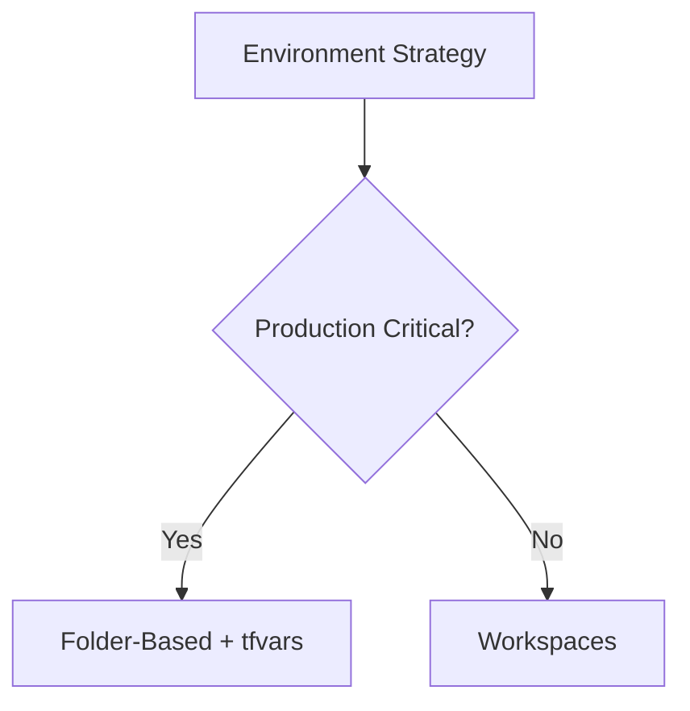

## 05.01– Environment Management

## 1. Dev / QA / Prod Strategy

Environments represent **levels of stability and risk**.

Typical characteristics:

* **Dev:** Fast changes, experimentation
* **QA:** Validation and testing
* **Prod:** Stability, controlled changes

Key rule:

> Production must always be protected from accidental changes.

Terraform helps enforce this separation using structure and configuration.

---

## 2. Workspaces

Terraform workspaces allow **multiple state files** for the same configuration.

Mental model:

> "Same code, different state."

Key points:

* Each workspace has its own state
* Default workspace exists by default
* Same `.tf` files are reused

### Pros

* Simple setup
* No code duplication

### Cons

* Easy to apply changes to wrong environment
* Harder to visualize environment differences

Workspaces are best for **simple setups**, not complex production systems.

---

## 3. Folder-Based Environments

Each environment has its **own directory**.

Mental model:

> "Separate folders, separate execution."

Typical structure:

* `env/dev`
* `env/qa`
* `env/prod`

### Pros

* Strong isolation
* Clear visibility
* Safer for production

### Cons

* More directories
* Some repetition

This is the **most common production approach**.

---

## 4. Variable Files per Environment

Terraform supports environment-specific variable files.

Mental model:

> "Same code, different values."

Common files:

* `dev.tfvars`
* `qa.tfvars`
* `prod.tfvars`

This approach is often combined with:

* Folder-based environments
* CI/CD pipelines

---

## 5. Pros & Cons of Each Approach

### Workspaces

* Easy to start
* Risky for large teams

### Folder-Based

* Clear separation
* Safer for production

### Variable Files

* Flexible
* Requires discipline

Decision guide:

Rule of thumb:

> Use folders for safety, workspaces for simplicity.

---

## Phase Outcome

After this phase, you can:

* Design multi-environment Terraform setups
* Protect production environments
* Choose the right environment strategy

You can now manage **real-world Terraform environments**.

---

## Practice Challenges – Phase 11

1. Explain why production must be isolated.
2. Describe workspaces without using the word "state".
3. Why are folders safer than workspaces?
4. How do variable files help environment management?
5. Choose an environment strategy for a large team.

