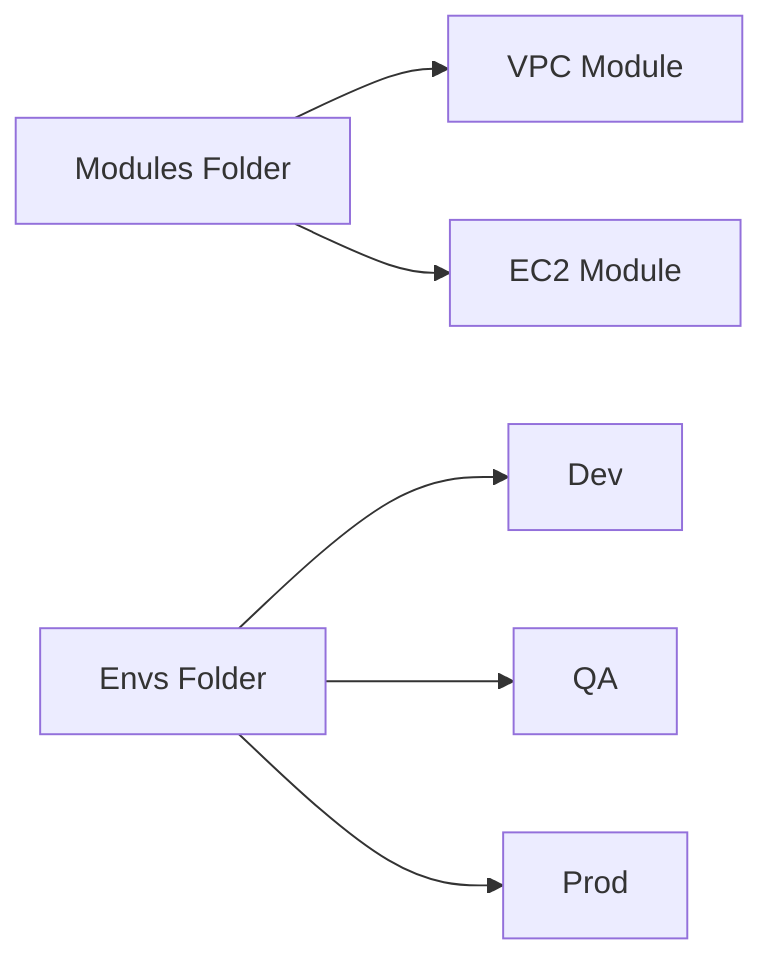
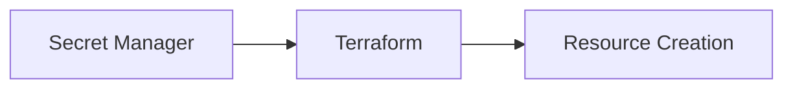

## 05.02 – Best Practices & Standards

## 1. Terraform Folder Structure (Production-Grade)

A recommended production folder structure:

```
├── modules/            # Reusable modules
│   ├── vpc/
│   ├── ec2/
│   └── s3/
├── envs/               # Environment-specific folders
│   ├── dev/
│   ├── qa/
│   └── prod/
│       ├── main.tf
│       ├── variables.tf
│       ├── outputs.tf
│       └── terraform.tfvars
└── README.md           # Documentation
```

Best practices:

* Separate **modules** and **environment configs**
* Keep root module small
* Use **consistent naming** for clarity



---

## 2. Naming Conventions

* Use lowercase letters and hyphens
* Be consistent across modules and resources
* Include environment in resource names for clarity

Example:

```
app-dev-vpc
app-prod-ec2
```

---

## 3. Secrets Management Basics

Do not hardcode secrets in Terraform code.

Options:

* Use **environment variables**
* Use **secret managers** (AWS Secrets Manager, Azure Key Vault)
* Store sensitive data in **remote state with encryption**



---

## 4. `.gitignore` for Terraform

Prevent sensitive files from being committed:

```
*.tfstate
*.tfstate.backup
.terraform/
.terraform.lock.hcl
```

Security mindset:

> Never commit state files or credentials.

---

## 5. Code Formatting (`terraform fmt`)

Terraform provides `terraform fmt` to **automatically format code**.

Benefits:

* Consistent style
* Easier code reviews
* Readable modules and resources

---

## 6. Validation (`terraform validate`)

`terraform validate` checks **syntax and configuration correctness** without applying changes.

Benefits:

* Detect errors early
* Enforce consistency before CI/CD
* Reduces broken deployments

Best practice:

* Run `terraform fmt` and `terraform validate` before committing
* Integrate in CI/CD pipelines

---

## Phase Outcome

After this phase, you can:

* Organize Terraform projects professionally
* Follow naming conventions
* Manage secrets safely
* Format and validate code consistently

Your Terraform code now looks **professional and maintainable**.

---

## Practice Challenges – Phase 13

1. Draw a production-grade folder structure for a Terraform project.
2. Explain why hardcoding secrets is dangerous.
3. Write a `.gitignore` snippet for Terraform.
4. What does `terraform fmt` do?
5. How does `terraform validate` improve reliability?

