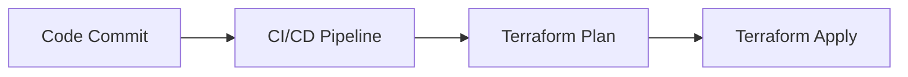
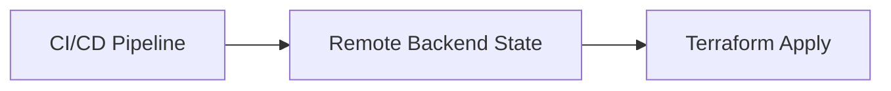

## PHASE 14 – Terraform in CI/CD (Intro)

## 1. Terraform in Pipelines

CI/CD pipelines automate Terraform commands:

* `terraform init`
* `terraform plan`
* `terraform apply`

Benefits:

* Consistency across environments
* Reduce human error
* Track changes via version control

Mental model:

> "Git triggers Terraform to manage infrastructure automatically."

---

## 2. Plan vs Apply Separation

Best practice in automation:

* `plan` generates a preview of changes
* `apply` executes changes, preferably **after approval**

Advantages:

* Safety check before applying
* Prevents accidental deletions or updates

Example workflow:

1. Commit changes
2. CI runs `terraform plan`
3. Manual approval or automated check
4. Apply changes to target environment

---

## 3. Remote Backends in CI/CD

Using remote state is critical in automation:

* Centralized state storage
* Supports **locking** to avoid conflicts
* Enables multiple pipeline runs without collisions

Examples:

* AWS S3 with DynamoDB locking
* Terraform Cloud / Enterprise

---

## 4. Common Mistakes in Automation

* Applying without plan review
* Using local state in pipelines
* Hardcoding credentials in pipeline scripts
* Not isolating environments
* Not handling sensitive outputs correctly

Mitigation:

* Always separate `plan` and `apply`
* Use remote backends with locking
* Inject credentials securely
* Use workspace or folder-based environment isolation

---

## Phase Outcome

After this phase, you can:

* Integrate Terraform into pipelines
* Understand the safety of plan vs apply
* Use remote backends in automation
* Avoid common automation pitfalls

You are now ready for **real-world Terraform projects with automation**.

---

## Practice Challenges – Phase 14

1. Draw a simple CI/CD pipeline with Terraform.
2. Explain why plan and apply should be separated.
3. Why is a remote backend mandatory in automation?
4. List three common mistakes in Terraform CI/CD.
5. Describe a safe workflow for Dev to Prod pipeline.
