# Practice -2
### Terraform EC2 with Remote Backend (Simple Guide)

---

## 1. What We Are Building

* One EC2 instance
* Terraform state stored in **S3**
* State locking using **DynamoDB**

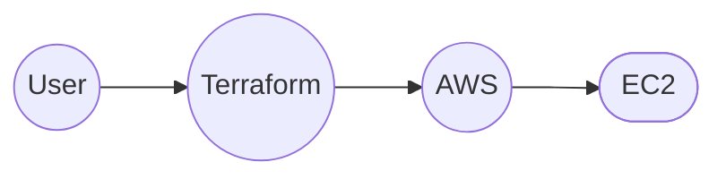

---

## 2️. Why Terraform Needs State

Terraform must remember:

* What it already created
* What must be changed
* What must be deleted

This memory = **terraform.tfstate**

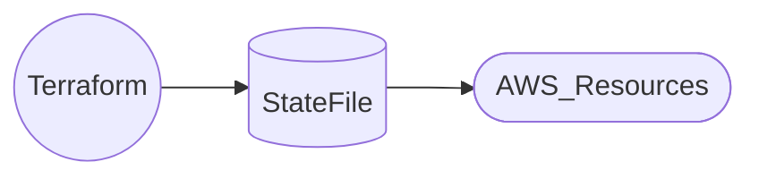

---

## 3. Problem with Local State

Local state means:

* Stored on one laptop
* No sharing
* No locking
* Risk of overwrite

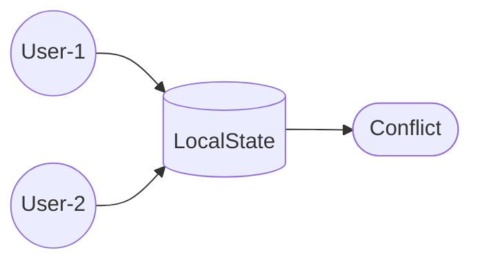

**Unsafe for teams**

---

## 4. Why We Use Backend File

Backend decides:

* Where state lives
* How state is locked
* Who can access it

We use:

* **S3** for storage
* **DynamoDB** for locking

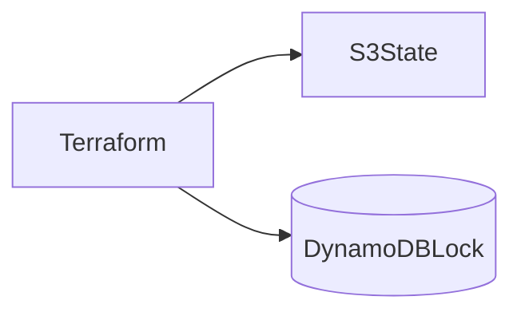

---

## 5. Why S3 + DynamoDB

**S3**

* Durable
* Cheap
* Encrypted
* Shared

**DynamoDB**

* Prevents two applies at same time
* Avoids state corruption

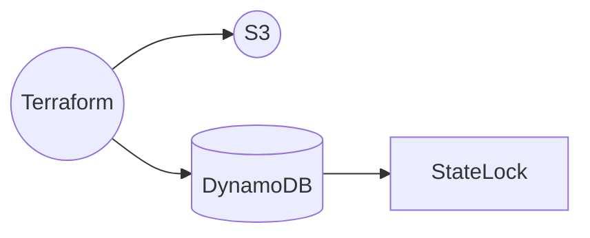

---
## 6. Why Backend Is Separate

Terraform needs backend **before** it runs.

Order:

1. Read backend
2. Load state
3. Create resources

So backend **cannot be created inside same Terraform code**.

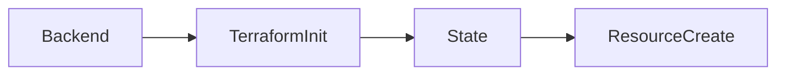

---

## 7. Folder Structure

```yaml
terraform-ec2/
├── backend.tf
├── provider.tf
├── main.tf
├── variables.tf
├── outputs.tf
```
---
## 8. Backend Configuration

```python
terraform {
  backend "s3" {
    bucket         = "arira-terraform-state"
    key            = "ec2/dev/terraform.tfstate"
    region         = "us-east-1"
    dynamodb_table = "terraform-lock-table"
    encrypt        = true
  }
}
```

Meaning:

* `bucket` = where state is stored
* `key` = env path
* `dynamodb_table` = locking

---
## 9. Provider

```hcl
provider "aws" {
  region = "us-east-1"
}
```

Tells Terraform **which cloud**.

---

## 10. EC2 Creation

```hcl
data "aws_ami" "amazon_linux" {
  most_recent = true
  owners      = ["amazon"]
}

resource "aws_instance" "demo" {
  ami           = data.aws_ami.amazon_linux.id
  instance_type = "t2.micro"
  key_name      = var.key_name
}
```

Why data source?

* Always latest AMI
* No hardcoding

---
## 11. Terraform Workflow

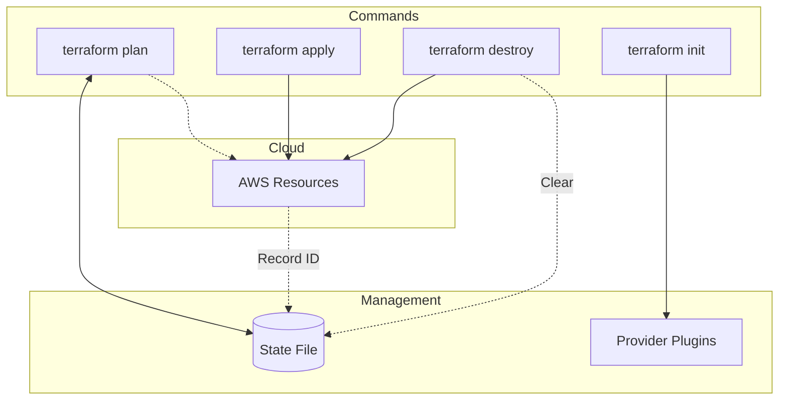

---

## 12.  What Happens When Two People Apply

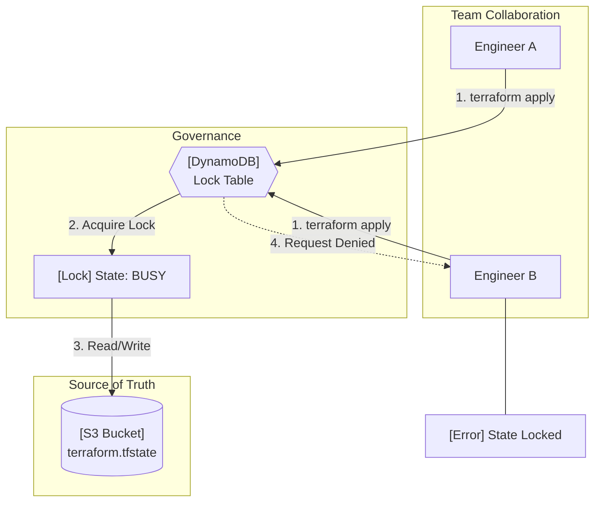

# Best Practices
#  Terraform State & Locking – Recovery and Edge Scenarios

Terraform state is **critical infrastructure metadata**.
The following scenarios explain **what can go wrong**, **why**, and **exactly what to do**.

---

## Scenario List (High → Low impact)

1. tfstate file deleted from S3 (resources still exist)
2. Terraform state is locked (DynamoDB lock not released)
3. S3–DynamoDB checksum mismatch
4. Partial state loss (some resources missing)
5. State drift (manual AWS changes)
6. Wrong backend or state key configured
7. Multiple users modifying same infra
8. Accidental resource recreation risk


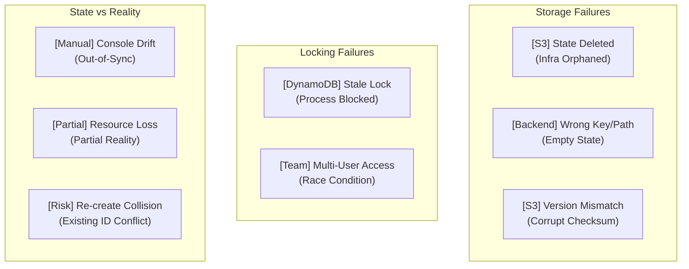

---

## 1. tfstate file deleted from S3 (resources still exist)

### What happened

* AWS resources still exist
* Terraform lost its state
* Terraform thinks infra does NOT exist

>Running `terraform apply` now can **duplicate resources**

---

###  Correct recovery steps

1. Reinitialize backend

```bash
terraform init -reconfigure
```

2. Identify existing AWS resources (example EC2)

```bash
aws ec2 describe-instances --query "Reservations[].Instances[].InstanceId" --output text
```

3. Import resources back into state

```bash
terraform import aws_instance.demo i-xxxxxxxx
```

4. Verify

```bash
terraform state list
terraform plan
```

---

### Flow diagram

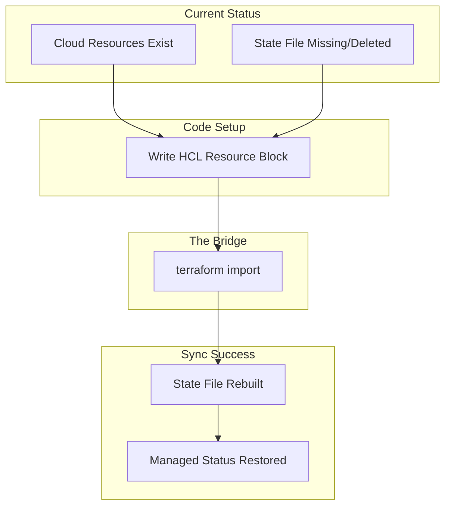

---

### What NOT to do

* Do not run `terraform apply` before import
* Do not recreate infra manually
* Do not guess resource IDs

---

## 2. Terraform state is locked (DynamoDB lock not released)

### What happened

* Terraform crashed or was force-stopped
* DynamoDB lock entry still exists
* New Terraform runs are blocked

Typical error:

```text
Error acquiring the state lock
```

---

### Safe ways to release lock

1. Option A: Automatic (recommended)
2. Option B: Manual (console)

#### Option A: Automatic (recommended)

```bash
terraform force-unlock <LOCK_ID>
```

#### Option B: Manual (console)

* DynamoDB → `terraform-locks`
* Delete **only the lock item**
* Do NOT delete table

---

### Lock lifecycle

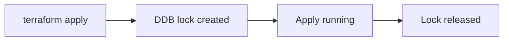

---

### Important warning

Never force-unlock if:

* Another apply is running
* Another engineer is working

---

## 3. S3–DynamoDB checksum mismatch

### What happened

* tfstate deleted or modified in S3
* DynamoDB still stores old checksum
* Terraform detects corruption

Error:

```text
checksum calculated for the state does not match
```

---

### Fix procedure

Option 1 (preferred):

* DynamoDB → delete the **lock item only**

Option 2 (dev only):

* Delete and recreate DynamoDB table

Then:

```bash
terraform init -reconfigure
```

---

### Diagram

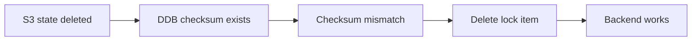

---

## 4. Partial state loss (some resources missing)

### What happened

* State file exists
* Some resources missing from state
* Infra partially managed

---

### Fix

1. List current state

```bash
terraform state list
```

2. Import missing resources

```bash
terraform import aws_security_group.demo sg-xxxx
```

3. Validate

```bash
terraform plan
```

---

### Diagram

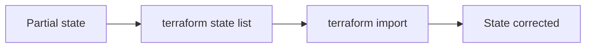

---

## 5. Terraform drift 

### What happened

* Infra modified via AWS Console / CLI
* Terraform state is outdated

---

### Detect and fix

```bash
terraform plan
```

If drift exists:

* Update Terraform code to match AWS
* OR revert AWS changes

---

### Diagram

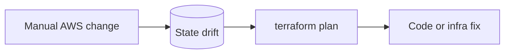

---

## 6. Wrong backend or state key configured

### What happened

* Wrong S3 bucket
* Wrong `key` path
* Terraform creates a new empty state

---

### Fix

1. Verify backend config

```hcl
bucket = "ar-terraform-state"
key    = "ec2/dev/terraform.tfstate"
```

2. Reconfigure

```bash
terraform init -reconfigure
```

---

## 7. Multiple users modifying same infra

### What happened

* Same backend
* No locking OR locking bypassed
* Race conditions

---

### Prevention

* Always enable DynamoDB locking
* Never disable backend lock
* One apply at a time

---

### Diagram

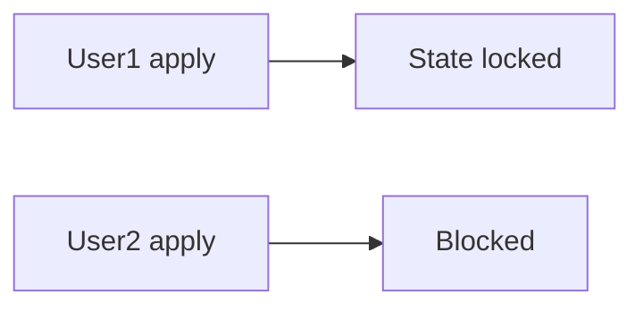

---

## 8. Accidental resource recreation risk

### High-risk scenario

* Empty state
* Existing infra
* `terraform apply` executed

---

### Result

* Duplicate EC2s
* Broken networking
* Unexpected cost

---

### Golden rule

> **If state is missing — IMPORT FIRST**

---

## Best Practices Summary

* Enable **S3 versioning**
* Protect tfstate with IAM
* Never delete tfstate casually
* Use DynamoDB locking always
* Treat tfstate as **production data**
