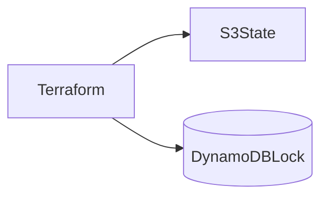
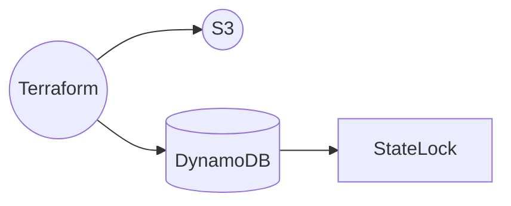
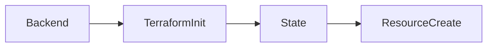
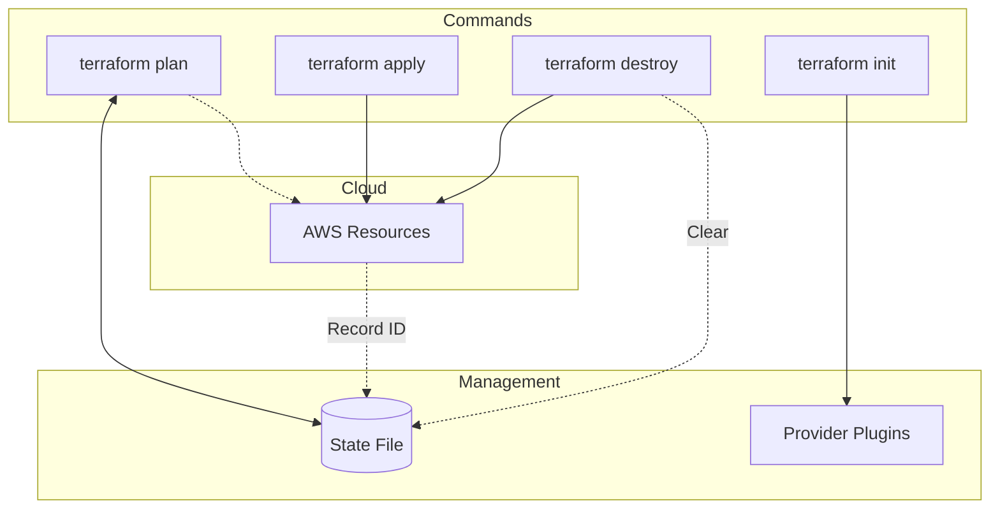
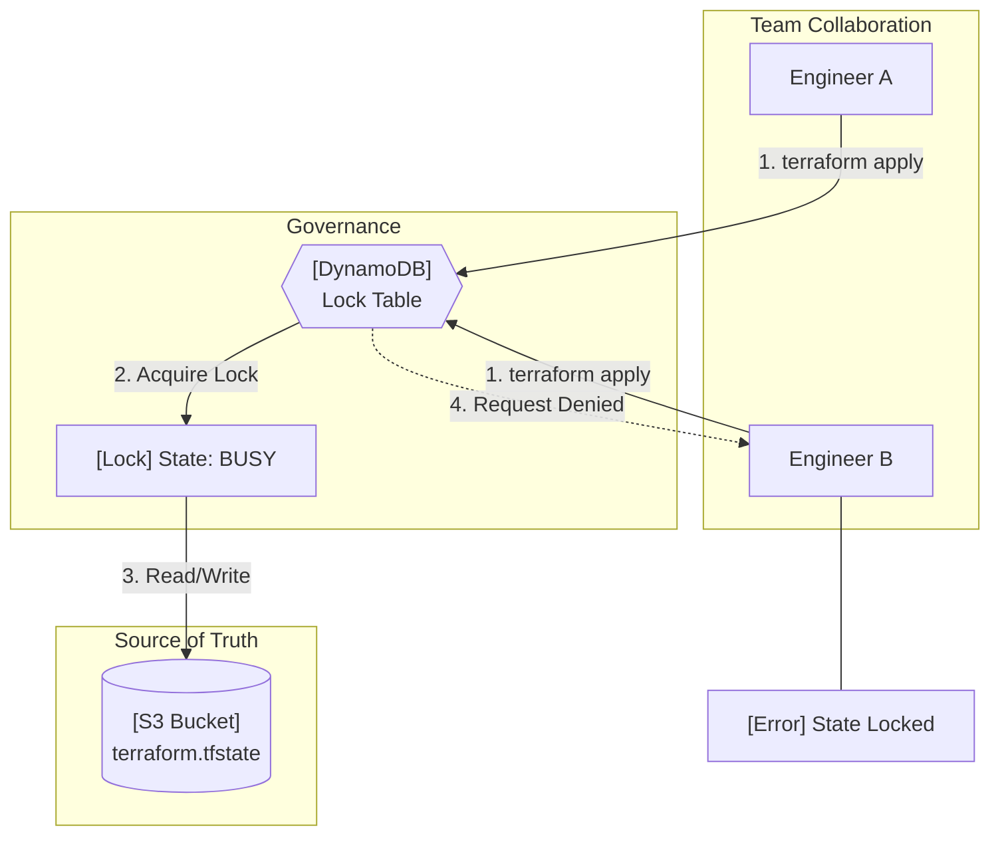

# Practice -2
### Terraform EC2 with Remote Backend (Simple Guide)

---

## 1. What We Are Building

* One EC2 instance
* Terraform state stored in **S3**
* State locking using **DynamoDB**


---

## 2️. Why Terraform Needs State

Terraform must remember:

* What it already created
* What must be changed
* What must be deleted

This memory = **terraform.tfstate**


---

## 3. Problem with Local State

Local state means:

* Stored on one laptop
* No sharing
* No locking
* Risk of overwrite


**Unsafe for teams**

---

## 4. Why We Use Backend File

Backend decides:

* Where state lives
* How state is locked
* Who can access it

We use:

* **S3** for storage
* **DynamoDB** for locking



---

## 5. Why S3 + DynamoDB

**S3**

* Durable
* Cheap
* Encrypted
* Shared

**DynamoDB**

* Prevents two applies at same time
* Avoids state corruption



---
## 6. Why Backend Is Separate

Terraform needs backend **before** it runs.

Order:

1. Read backend
2. Load state
3. Create resources

So backend **cannot be created inside same Terraform code**.



---

## 7. Folder Structure

```yaml
terraform-ec2/
├── backend.tf
├── provider.tf
├── main.tf
├── variables.tf
├── outputs.tf
```
---
## 8. Backend Configuration

```python
terraform {
  backend "s3" {
    bucket         = "arira-terraform-state"
    key            = "ec2/dev/terraform.tfstate"
    region         = "us-east-1"
    dynamodb_table = "terraform-lock-table"
    encrypt        = true
  }
}
```

Meaning:

* `bucket` = where state is stored
* `key` = env path
* `dynamodb_table` = locking

---
## 9. Provider

```hcl
provider "aws" {
  region = "us-east-1"
}
```

Tells Terraform **which cloud**.

---

## 10. EC2 Creation

```hcl
data "aws_ami" "amazon_linux" {
  most_recent = true
  owners      = ["amazon"]
}

resource "aws_instance" "demo" {
  ami           = data.aws_ami.amazon_linux.id
  instance_type = "t2.micro"
  key_name      = var.key_name
}
```

Why data source?

* Always latest AMI
* No hardcoding

---
## 11. Terraform Workflow



---

## 12.  What Happens When Two People Apply


