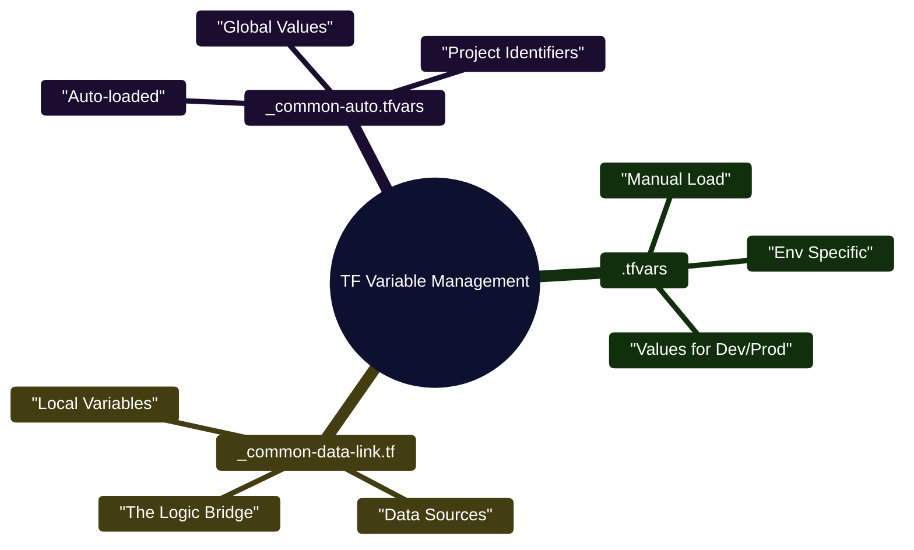
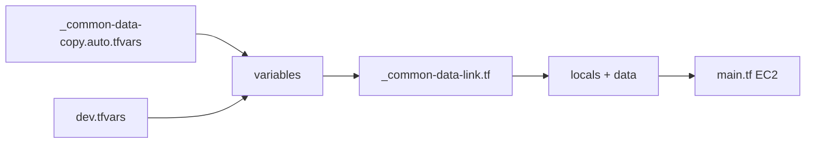

# Practice - 3

In a professional Terraform environment, managing variables across multiple environments (Dev, QA, Prod) requires a clean separation between :

* "What the code does" and 
* "What data it uses."

Below is a **complete, minimal, real-world Terraform setup** that uses **all three concepts together**:



### Comparison & Use Cases

| File Type | Load Priority | Purpose | Typical Content |
| --- | --- | --- | --- |
| **`.tfvars`** | Manual | **Environment-specific** overrides. | Instance types, environment names (`dev`, `prod`). |
| **`_common-data-link.tf`** | Always | **The "Glue"**: Fetches existing cloud IDs. | `data "aws_vpc" {}`, `locals { prefix = "my-app" }`. |
| **`_common-auto.tfvars`** | Automatic | **Global variables** shared by all envs. | Project IDs, Department names, Billing tags. |

---

### Real-Time Illustration: The "Web App" Scenario

Imagine you are deploying a Web Server.

#### 1. `_common-data-copy.auto.tfvars` (The Global Stuff)

Terraform reads this **automatically**. It contains settings that never change, regardless of the environment.

> **Content:** `project_id = "fintech-app"`, `owner = "ops-team"`

#### 2. `dev.tfvars` (The Environment Choice)

You pass this manually (e.g., `terraform apply -var-file="dev.tfvars"`). It contains the size and cost of this specific deployment.

> **Content:** `instance_size = "t3.micro"`, `env = "development"`

#### 3. `_common-data-link.tf` (The Intelligence)

This isn't just data; it's **code** that looks up information in AWS based on the variables above. It uses `locals` to combine the global and environment data into a single name.

> **Logic:** > * `data "aws_vpc" "selected" { tags = { Name = var.env } }`
> * `locals { server_name = "${var.project_id}-${var.env}" }`
> 
> 

---

### Why use this specific structure?

* **Zero Repetition:** You don't have to copy the "Project ID" into 10 different files. You put it once in the `.auto.tfvars` file.
* **Dynamic Discovery:** The `_common-data-link.tf` allows your code to "discover" the VPC ID or Subnet ID in AWS rather than you hardcoding them.
* **Safety:** By keeping `dev.tfvars` and `prod.tfvars` separate, you minimize the risk of accidentally applying "Production" sizes to your "Dev" environment.


The goal: **Create one EC2 instance**, with values flowing from all three layers in a predictable way.

---

# 1. Scenario

Desired :

* **Same Terraform code** across environments .
* **Common values** (tags, owner, AMI filters) reused everywhere .
* **Environment overrides** without touching code .

Design:

* `_common-data-link.tf` → defines reusable data & locals .
* `_common-data-copy.auto.tfvars` → global defaults (auto-loaded) .
* `dev.tfvars` → environment-specific overrides .

---

# 2. Final folder structure

```text
terraform-ec2/
├── main.tf
├── variables.tf
├── _common-data-link.tf
├── _common-data-copy.auto.tfvars
├── dev.tfvars
├── backend.tf
└── provider.tf
```

---

# 3. Provider & backend

### `1. provider.tf`

```hcl
provider "aws" {
  region = var.aws_region
}
```

### `2. backend.tf`

```hcl
terraform {
  backend "s3" {
    bucket         = "ar-terraform-state"
    key            = "ec2/dev/terraform.tfstate"
    region         = "us-east-1"
    dynamodb_table = "terraform-locks"
    encrypt        = true
  }
}
```

---

# 4. Common data link file

### `1. _common-data-link.tf`

Purpose:

* Central place for **shared data sources**
* Central place for **derived values (locals)**

```hcl
data "aws_ami" "amazon_linux" {
  most_recent = true
  owners      = ["amazon"]

  filter {
    name   = "name"
    values = [var.ami_name_pattern]
  }
}

locals {
  common_tags = {
    Project = var.project_name
    Owner   = var.owner
    Env     = var.environment
  }
}
```

No hardcoded values. Everything comes from variables.

---

# 5. Variables definition

### `1. variables.tf`

```hcl
variable "aws_region" {
  type = string
}

variable "environment" {
  type = string
}

variable "project_name" {
  type = string
}

variable "owner" {
  type = string
}

variable "instance_type" {
  type = string
}

variable "key_name" {
  type = string
}

variable "ami_name_pattern" {
  type = string
}
```

---

# 6. Auto-loaded common values (global defaults)

### `1. _common-data-copy.auto.tfvars`

Terraform **automatically loads** this file.
No `-var-file` needed.

```hcl
aws_region       = "us-east-1"
project_name     = "tf-ec2-demo"
owner            = "platform-team"
ami_name_pattern = "amzn2-ami-hvm-*-x86_64-gp2"
```

Used by:

* provider
* data sources
* locals

---

# 7. Environment-specific overrides

### `1. dev.tfvars`

Only values that differ per environment.

```hcl
environment   = "dev"
instance_type = "t2.micro"
key_name      = "dev-keypair"
```

---

# 8. Main EC2 resource

### `1. main.tf`

This file **does not know where values come from**.

```hcl
resource "aws_instance" "demo" {
  ami           = data.aws_ami.amazon_linux.id
  instance_type = var.instance_type
  key_name      = var.key_name

  tags = merge(
    local.common_tags,
    {
      Name = "tf-simple-ec2"
    }
  )
}
```

---

# 9. How values flow



Single-line labels, parser-safe.

---

# 10. How to run

```bash
terraform init
terraform plan -var-file=dev.tfvars
terraform apply -var-file=dev.tfvars
```

Why:

* `.auto.tfvars` → loaded automatically
* `dev.tfvars` → explicitly injected

---

# 11. What each file is responsible for (mental model)

| File                            | Responsibility               |
| ------------------------------- | ---------------------------- |
| `_common-data-link.tf`          | Shared data sources + locals |
| `_common-data-copy.auto.tfvars` | Global defaults              |
| `dev.tfvars`                    | Environment overrides        |
| `variables.tf`                  | Contract/interface           |
| `main.tf`                       | Pure infrastructure logic    |

---

# 12. Why this pattern scales

* Zero duplication
* Clean separation of concerns
* Easy multi-env (`prod.tfvars`, `stage.tfvars`)
* Safe for teams
* Backend-safe

---
