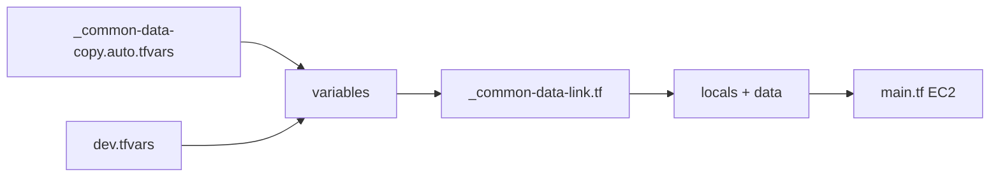

# Practice - 3

Below is a **complete, minimal, real-world Terraform setup** that uses **all three concepts together**:

* `.tfvars` (environment-specific values)
* `_common-data-link.tf` (shared data + locals)
* `_common-data-copy.auto.tfvars` (auto-loaded common values)

The goal: **Create one EC2 instance**, with values flowing from all three layers in a predictable way.

---

# 1. Scenario

Desired :

* **Same Terraform code** across environments .
* **Common values** (tags, owner, AMI filters) reused everywhere .
* **Environment overrides** without touching code .

Design:

* `_common-data-link.tf` → defines reusable data & locals .
* `_common-data-copy.auto.tfvars` → global defaults (auto-loaded) .
* `dev.tfvars` → environment-specific overrides .

---

# 2. Final folder structure

```text
terraform-ec2/
├── main.tf
├── variables.tf
├── _common-data-link.tf
├── _common-data-copy.auto.tfvars
├── dev.tfvars
├── backend.tf
└── provider.tf
```

---

# 3. Provider & backend

### `1. provider.tf`

```hcl
provider "aws" {
  region = var.aws_region
}
```

### `2. backend.tf`

```hcl
terraform {
  backend "s3" {
    bucket         = "ar-terraform-state"
    key            = "ec2/dev/terraform.tfstate"
    region         = "us-east-1"
    dynamodb_table = "terraform-locks"
    encrypt        = true
  }
}
```

---

# 4. Common data link file

### `1. _common-data-link.tf`

Purpose:

* Central place for **shared data sources**
* Central place for **derived values (locals)**

```hcl
data "aws_ami" "amazon_linux" {
  most_recent = true
  owners      = ["amazon"]

  filter {
    name   = "name"
    values = [var.ami_name_pattern]
  }
}

locals {
  common_tags = {
    Project = var.project_name
    Owner   = var.owner
    Env     = var.environment
  }
}
```

No hardcoded values. Everything comes from variables.

---

# 5. Variables definition

### `1. variables.tf`

```hcl
variable "aws_region" {
  type = string
}

variable "environment" {
  type = string
}

variable "project_name" {
  type = string
}

variable "owner" {
  type = string
}

variable "instance_type" {
  type = string
}

variable "key_name" {
  type = string
}

variable "ami_name_pattern" {
  type = string
}
```

---

# 6. Auto-loaded common values (global defaults)

### `1. _common-data-copy.auto.tfvars`

Terraform **automatically loads** this file.
No `-var-file` needed.

```hcl
aws_region       = "us-east-1"
project_name     = "tf-ec2-demo"
owner            = "platform-team"
ami_name_pattern = "amzn2-ami-hvm-*-x86_64-gp2"
```

Used by:

* provider
* data sources
* locals

---

# 7. Environment-specific overrides

### `1. dev.tfvars`

Only values that differ per environment.

```hcl
environment   = "dev"
instance_type = "t2.micro"
key_name      = "dev-keypair"
```

---

# 8. Main EC2 resource

### `1. main.tf`

This file **does not know where values come from**.

```hcl
resource "aws_instance" "demo" {
  ami           = data.aws_ami.amazon_linux.id
  instance_type = var.instance_type
  key_name      = var.key_name

  tags = merge(
    local.common_tags,
    {
      Name = "tf-simple-ec2"
    }
  )
}
```

---

# 9. How values flow



Single-line labels, parser-safe.

---

# 10. How to run

```bash
terraform init
terraform plan -var-file=dev.tfvars
terraform apply -var-file=dev.tfvars
```

Why:

* `.auto.tfvars` → loaded automatically
* `dev.tfvars` → explicitly injected

---

# 11. What each file is responsible for (mental model)

| File                            | Responsibility               |
| ------------------------------- | ---------------------------- |
| `_common-data-link.tf`          | Shared data sources + locals |
| `_common-data-copy.auto.tfvars` | Global defaults              |
| `dev.tfvars`                    | Environment overrides        |
| `variables.tf`                  | Contract/interface           |
| `main.tf`                       | Pure infrastructure logic    |

---

# 12. Why this pattern scales

* Zero duplication
* Clean separation of concerns
* Easy multi-env (`prod.tfvars`, `stage.tfvars`)
* Safe for teams
* Backend-safe

---
